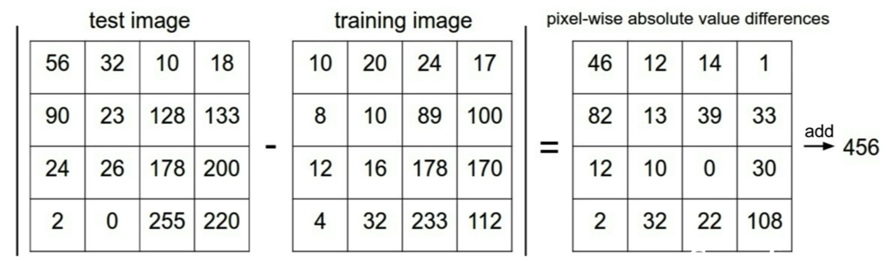

# Lecture 2 | Image Classification


Image Classification: A core task in Computer Vision


the problem: Semantic Gap

- the computer is representing the image as gigantic grid of numbers.
- for example, the image might be something like 800 by 600 pixels, each pixels is represented by three numbers, giving the red, green, and blue values for that pixel.


**Challenges: Viewpoint variation**

- when change the picture in very small, subtle ways that will cause this pixel grid to change entirely.


**Challenges: Illumination**

- for example, whether the cat is apperaing in this very dark, moody scene, or very bright, sunlit scene, it's still a cat. And our algorithms need to be robust to that


**Challenges: Deformation**

- for example, cats can really assume a lot of different, varied poses and position. And our algorithms should be robust to these different kinds of transforms.


**Challenges: Occlusion**

- if you might only see part of an object, you can realize that object. And our algorithms also must be robust to.


**Challenges: Background Clutter**

**Challenges: Intraclass variation**

- for example, one notion of cat-ness, actually spans a  lot of different visual appearances. and cats can come in different shapes and sizes, colors and ages. And our algorithms ,again, needs to work and handle all these different variations. 


when we're trying to recognize objects, there's no really clear, explicit algorithm. unlike sorting a list of numbers.


### Attempts have been made

- Edges are pretty import when it comes to visual recognition.
- so one thing we might try to do is compute the edges of this image and then go in and try to categorize all the different corners and boundaries and write explicit set of rules for recognizing object.
- But this turns out not to work very well. because
  1. it's super brittle
  2. if you want to start over for another object category, you need to start all over again.


### Data-Driven Approach

1. Collect a dataset of images and labels
2. Use Machine Learning to train a classifier
3. Evaluate the classifier on new images

```python
def train(images, labels):
	# Machine learning!
  return model
```

 ```python
def predict(model, test_images):
	# Use model to predict labels
	return test_labels
 ```


### First Classifier: Nearest Neighbor

- algorithm is pretty dumb.
- during the training step, just memorize all of the training data.
- during the prediction step, going to take some new image and try to find the most similar image in the training data to that new image.
- pick visually similar image in the training images, although they are not always correct.


### Distance Metric

#### L1 distance(== Manhattan distance)

- 

- 

- 

- just compare individual pixels on the images.

- ```python
  # Nearest Neighbor Classifier
  import numpy as np
  
  class NearestNeighbor:
    def __init__(self):
      pass
    
    def train(self, X, y):
      ''' 
      X is N x D where each row is an example.
      Y is 1-dimension of size N
      '''
      # the nearest neighbor classifier simply remembers all the training data
      self.Xtr = X
      self.ytr = y
      
    def predict(self, X):
      '''
      X is N x D where each row is an example we wish to predict label for
      '''
      num_test = X.shape[0]
      # lets make sure that the output type matches the input type
      Ypred = np.zeros(num_test, dtype = self.ytr.dtype)
      
      # loop over all test rows
      for i in range(num_test):
        # find the nearest training image t the i'th test image
        # using the L1 distance (sum of absolute value differences)
        distances = np.sum(np.abs(self.Xtr - X[i,:]), axis = 1)
        min_index = np.argmin(distances) # get the index with smallest distance
        Ypred[i] = self.ytr[min_index] # predict the label of the nearest example
        
      return Ypred
  ```


Q: With N examples, how fast are training and prediction?

A: train O(1), predict O(N)

- this is bad: we want classifiers that are fast at prediction. slow for training is ok


**K-Nearest Neighbors**


- find K or our nearest neighbors, according to our distance metric, and  then take a vote among each of neighbors.
- predict a marofity vote among our neighbors.


Q: What is the deal with these white regions?

A: the white regions are where there was no majority among the k-nearest neighbors.


#### L2 distance(== Euclidean distance)

- 
- 
- L1 distance depends on your choice of coordinates system. So if you were to rotate the coordinate frame that would actually change the L1 distance between the points.
- Whereas changing the coordinate frame in the L2 distance doesn't matter. it's the same thing no matter what your coordinate frame is.
- So maybe if your input features, if the individual entries in your vector have some important meaning for your task, then maybe somehow L1 might be a more natural fit.
- But if it's just a generic vector in some space and you don't know which of the differenct elements, what they actually mean, then maybe L2 is slightly more natural.


K-Nearest Neighbors Demo: http://vision.stanford.edu/teaching/cs231n-demos/knn/


### Hyperparameters

choices about the algorithm that we set rather than learn

- what is the best value of k to use?
- what is the best distance to use?

how do you set these things in practice?

- very problem-dependent.
- must try them all out and see what works best.


Q: Where L1 distance might be preferable to using L2 distance?

A: mainly problem-dependent. but i think when your individual elements actually have some meaning, is where i think maybe using L1 might make a little bit more sense. because L1 depends on the coordinate system. but the best answer is just to try them both and see what workds better.


**Setting Hyperparameters**

- Idea #1: Choose hyperparameters that work best on the training data
  - this is actually a really terrible idea.
  - for example, in K-Nearest neighbor, k = 1 always workd perfectly on training data.
  - and ultimately in machine learning, we don't care aboute fitting the training data, we really care about how our classifier will perform on unseen data after training.
- Idea #2: Split data into train and test, choose hyperparameters that work best on test data
  - this seems like maybe a more reasonable strategy, but, in fact, this is also a terrible idea.
  - the point of the test set is to give us some estimate of how our method will do on unseen data that's coming our from the wild. 
  - our performance on this test set will no longer be representative of our performance of new, unseen data.
- Idea #3: Split data into train, validation, and test. choose hyperparameters on validation and evaluate on test
  - go train our algorithm with many differenct choices of hyperparameters on the traininig set, evaluate on the validation set, and now pick the set of hyperparameters which performs best on the validation set. and run it once on the test set.
  - it's much better
- Idea #4: Cross-Validation: Split data into folds, try each fold as validation and average the results
  - Useful for small datasets, but not used too frequently in deep learning.
  - when you do it this way, you get much higher confidence about which hyperparameters are going to perform more robustly. but in practice in deep learning, when we're training large models and training is very computationaly expensive, these doesn't get used too much in practice.


Q: A little bit more concretely, what's the difference between the training and the validation set?

A: where your algorithm is able to see the labels of the training set, but for the validation set, your algorithm doesnt' have direct access to the labels. we only use the labels of the validation set to check how well our algorithms are doing.


Q: Whether the test set, is it possible that the test set might not be representative of data out there in the wild?

A: this definitely can be a problem in practice, the underlying statistical assumption here is that your data are all independenty and identically distributed, so that all of your data points should be drawn from the same underlying probability distribution. 

when i'm creating datasets, for example, one thing i do, is go and collect a whole bunch of data all at once, using the exact same methodology for collecting the data, and then afterwards you go and partition it randomly between train and test.

one thing that can screw you up here is maybe if you're collecting data over time and you make the earlier data, that you collect first, be the training data, and the later data that you collect be the test data, then you actually might run into this shift that could cause problems. but as long as this partition is random among your entire set of data points, then that's how we try to alleviate this problem in practice.


**K-Nearest Neighbor** on images never used.

- very slow at test time.
- Distance metrics on pixels are not informative


- L2 distance between the original and the boxed, the original and the shuffled, and original in the tinted, they all have the same value.
- which is maybe not so good. because L2 distance is really not doing a very good job at capturing these perceptional distances between images.
- curse of dimensionality


Q: why do these images have the same L2 distance?

A: bacause it is carefully constructed them to have the same L2 distance.


Q: whether or not it's common in real-world, cases to go back and retrain the entire dataset once you've found those best hyperparameters?

A: people sometimes do this in practice, but it's somewhat a matter of taste.


### linear Classification

one analogy people often talk about when working with neural networks is we think of them as being kind of like Lego blocks. that you can have different kinds of components of neural networks and you can stick these components togetehr to build these large different towers of convolutional networks.

one of the most basic building blocks that we'll see in different types of deep learning applications is this linear classifier.


the linear classifier is one of the simplest examples of what we call a parametric model.


- have two different component. x for our input data and also a set of parameters, or weights, which is usually called W, also somtimes theta.
- f(x, W) = Wx
  - f(x, W) = 10 x 1 size
  - x = (32 x 32 x 3) x 1 = 3072 x 1
  - => W = 10 x 3072
- f(x, W) = Wx + b
  - also sometimes, we'll often add a bias term which will be a constant vector of 10 elements that does not interact with the training data, and instead just gives us some sort of data independent preferences for some classes over another.
- 
- 
- 


