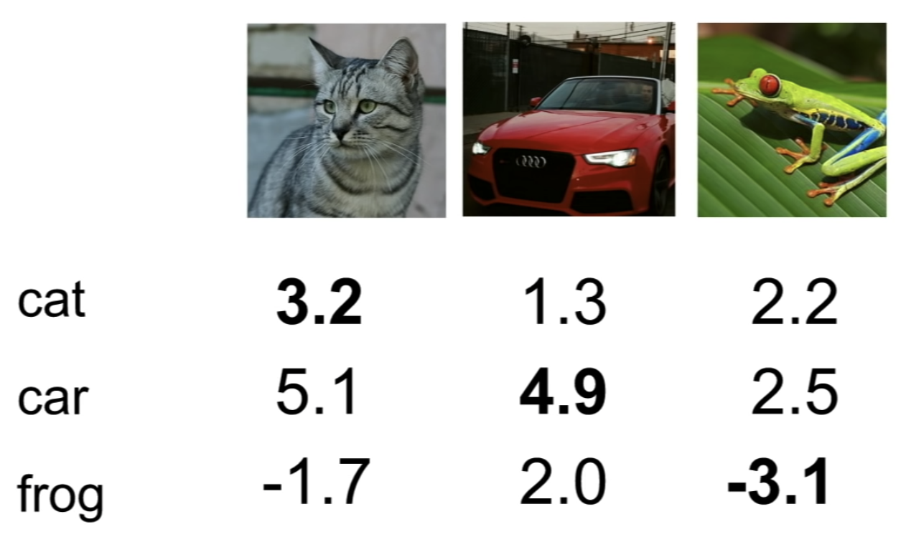
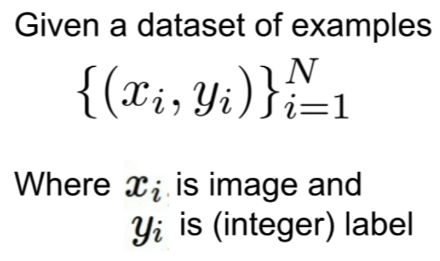
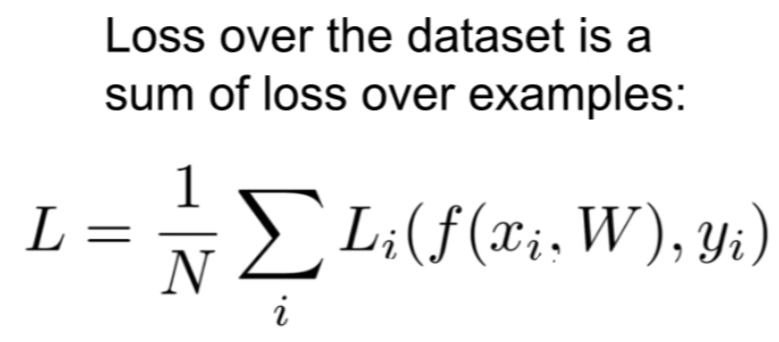
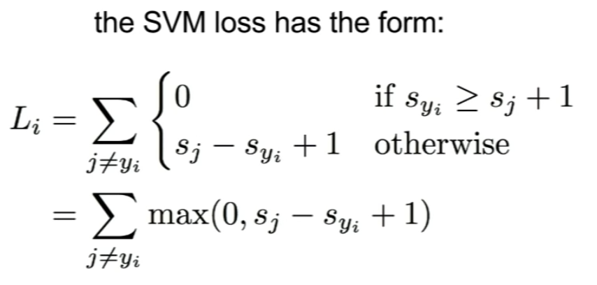
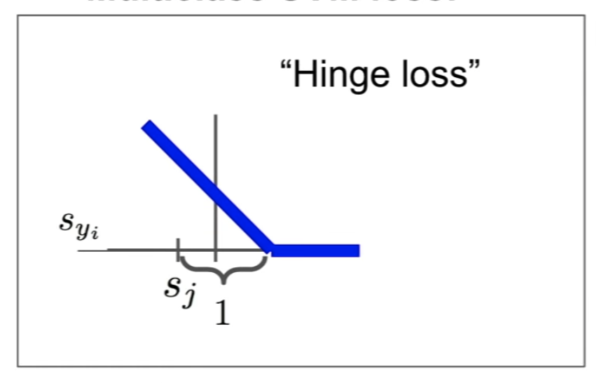
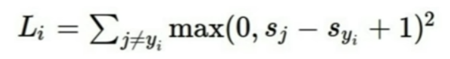
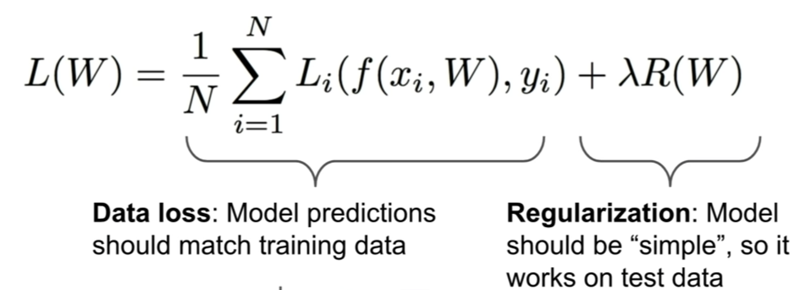
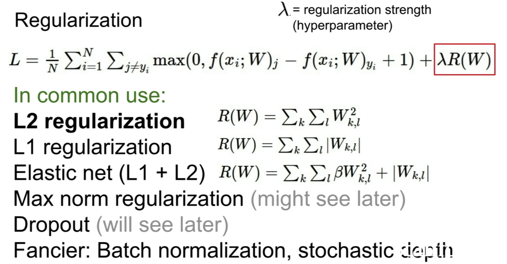

# Lecture 3 | Loss Functions and Optimization


TODO

1. Define a **loss function** that quantifies our unhappiness with the scores across the training data.
2. Come up with a way of effieiently finding the parameters that minimize the loss function(**optimization**)


Example

- Suppose: 3 training examples, 3 classes.
- With some W the scores f(x, W) = Wx
- 


**loss function** tells how good our current classifier is






### Multi-class SVM loss



- perform a sum over all of the categories, Y, except for the true category, Y_i
- so, sum over all the incorrect categories and then we're going to compare the score of the correct category, and the score of the incorrect category.
- now if the score for the correct category is greater than the score of the incorrect category(greater than the incorrect score by some safety margin that we set to one), it's means that the score for the true category is much larger than any of the false categories, then we'll get a loss of zero.
- this kind of like "if~then~" statement
- it is often referred to as some type of a hinge loss
  - 


Q: In terms of notation, what is S and what is S_y_i in particular?

A: the S are the predicted scores for the classes that are coming out of the classifier. and that y_i is the category of the ground truth label for the example which is some integer. so S_y_i corresponds to the score of the true class for the i-th example in the training set.


Q: What exactly is this computing here?

A: in some sense, what this loss is saying is that we are happy if the true score is much higher than all the other scores. It needs to be higher than all the other scores by some safety margin. and if the true score is not high enough, greater than any or the other scores, then we will incur some loss and that would be bad.


SVM example


if "cat" is the correct class, so we're going to loop over the car and frog classes

=> L_i = max(0, 5.1 - 3.2 + 1) + max(0, -1.7 - 3.2 + 1)

​			= max(0, 2.9) + max(0, -3.9)

​			= 2.9 + 0 = 2.9


if "car" is the correct class,

=> L_i = max(0, 1.3 - 4.9 + 1) + max(0, 2.0 - 4.9 + 1)

​			= max(0, -2.6) + max(0, -1.9)

​			= 0 + 0 = 0


if "frog" is the correct class,

=> L_i = max(0, 2.2 - (-3.1) + 1) + max(0, 2.5 - (-3.1) + 1)

​			= max(0, 6.3) + max(0, 6.6)

​			= 6.3 + 6.6 = 12.9


L = (2.9 + 0 + 12.9) / 3 = 5.27


Q: how do you choose the plus one?

A: It seems like kind of an arbitrary choice here, it's the only constant that appears in the loss function and that seems to offend your aesthetic sensibilities a bit maybe. but it turns out that this is somewhat of an arbitrary choice, because we don't actually care about the absolute values of the scores in this loss function, we only care about the relative differences between the scores. so in fact if you imagine scaling up your whole W up or down, then it kind or rescales all the scores correspondingly and if you kind of work throught the details and there's a detailed derivation of this in the course notes online, you find this choice of one actually doesn't matter.


Q1: what's going to happen to the loss if we change the scores of the car image just a little bit? 

A: if we jiggle the scores for this car image a little bit, the loss will not change. So the SVM loss, remember, the only thing it cares about is getting the correct score to be greater than one ore than the incorrect scores, but in this case, the car score is already quite a bit larger than the others, so if the scores for this class changed for this example changed just a little bit, this margin of one will still be retained and the loss wil not change.


Q2: what's the min and max possible loss in SVM?

A: min == 0, max == infinity.


Q3: sort of when you initialize these things and start training from scratch, usually you kind of initialize W with some small random values, as a result your scores tend to be sort of small uniform random values at the beginning of training. if all of your Ss, if all of the scores are approximately zero and approximately equal, then what kind of loss do you expect when your're using multiclass SVM?

A: number of classes minus one. Because remember that if we're looping over all of the incorrect classes, so we're looping over (C - 1) classes, within each of those classes the two Ss will be aboute the same, so we'll get a loss of one because of the margin and we'll get C - 1.

if the loss you actually see at the start of training at that first iteration is not equal to C-1, that means you probably have a bug and you should go check your code. so this is actually kind of a useful thing to be checking in practice.


Q4: what happens if the sum is also over the correct class if we just go over everything?(including j=y_i)

A: the loss increases by one. 


Q5: What if we used mean instead of sum?

A: it doesn't change. so the number of classes is going to be fixed ahead of time when we select our data set, so that's just rescaling the whole loss function by a constant, so it doesn't really matter.


Q6: what if we change this loss formulation and we actually added a square term on top of this max?



would this end up being the same problem or would this be a different classification algorithm?

A: this would be different.this would end up actually computing a different loss function. this idea of a squared hinge loss actually does get used sometimes in practice, so that's kind of another trick to have in your bag when you're making up your own loss functions for your own problems.


Q: why would you ever consider using a squared loss instead of a non-squared loss?

A: the whole point of a loss function is to kind of quantify how bad are different mistakes. and if the classifier is making different sorts of mistakes, how do we weight off the different trade-offs between different types of mistakes the classifier mght make? so if you're using a squared loss, that sort of says that things that are very bad, are now going to be sqaured bad. whereas if you're using this hinge loss, we don't actually care between being a little bit wrong and being a lot wrong, this idea of using a linear versus a square is a way to quantify how much we care about differenct categories of errors. 


Multi-class SVM loss - Example code

```python
def L_i_vectorized(x, y, W):
	scores = W.dot(x)
  margins = np.maximum(0, scores - scores[y] + 1)
  margins[y] = 0
  loss_i = np.sum(margins)
  return loss_i
```


Q: Suppose that we found a W such that L = 0. is this W unique?

A: No! 2W is also has L = 0!

Ex) 

W : max(0, 1.3 - 4.9 + 1) + max(0, 2.0 - 4.9 + 1)

​	= max(0, -2.6) + max(0, -1.9)

​	= 0 + 0 = 0

2W : max(0, 2.6 - 9.8 + 1) + max(0, 4.0 - 9.8 + 1)

​	= max(0, -6.2) + max(0, -4.8)

​	= 0 + 0 = 0



there's this whole idea of Occams' Razor, which is this fundamental idea in scientific discovery more broadly, which is that if you have many different competing hypotheses, that could explain your observations, you should generally prefer the simpler one, because that's the explanation that is more likely to generalize to new observations in the future.


Q: What's the connection between this lambda, R, W term and actually forcing this wiggly line to become a straight green line?

A: i didn't want to go through the derivation on this because i thought it would lead us too far astray, but you can imagine, maybe you're doing a regression problem, in terms of different polynomial basis functions, and if you're adding this regression penalty, maybe the model has access to polynomials of very high degree, but through this regression term you could encourage the model to prefer polynomials of lower degree, if they fit the data properly, or if they fit the data relatively well. either you can constrain your model class to just not contain the more powerful, more complez models, or you can add this soft penalty where the model still has access to more complex models, maybe high degree polynomials in this case, but you add this soft constraint, saying that if you want to use these more complex models, you need to overcome this penalty for using their complexity.




- the idea of L2 regularization is you're just penalizing the euclidean norm of this weight vector.
- the L1 regularization has some nice properties like encouraging sparsity in this matrix W.


Q: how does the L2 regularization measure the complexity of the model?

A: so here we maybe have some training example, x, and there's two different Ws that we're considering. so x is just this vector of four ones, and we're considering these two difference possibilities, one is a single one and three zeros, and the other has this 0.25 spread across the four differenct entries. and now, when we're doing linear classification, we're really taking dot products between our x and our W. so in terms of linear classification, these two Ws are the same, because they give the same result when dot producted with x. if you look at these two examples, which one would L2 regression prefer? L2 regression would prefer W2. because it has a smaller norm.So L2 regularization is saying that it prefers to spread that influence across all the different values in x. and by the way, L1 regularization has this opposite interpretation. 