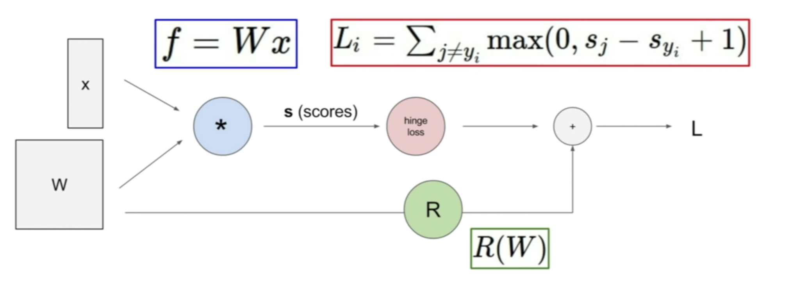
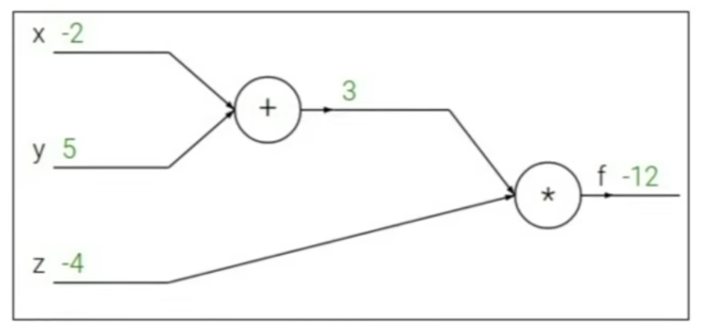
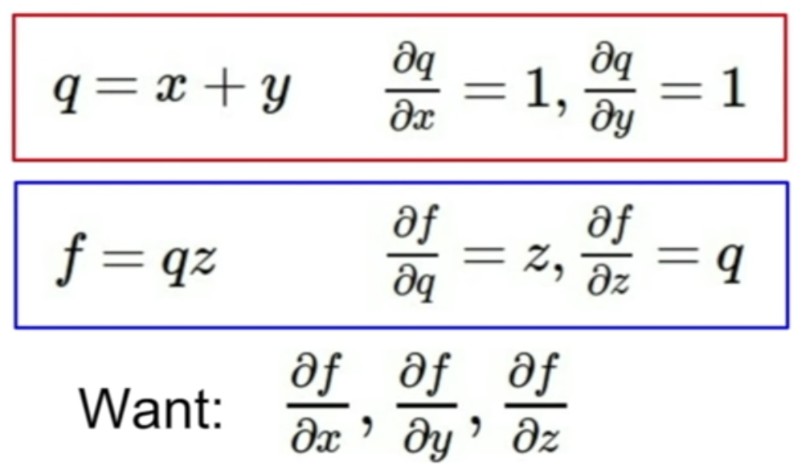
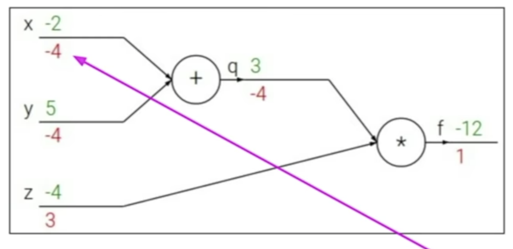

# Lecture 4 | Introduction to Neural Networks

TODO

- how to compute the analytic gradient for arbitrarily complex functions

 

### Computational graphs

- the advantage is that once we can express a function using a computational graph
- and we can use a technique that we call backpropagation whitch is going to recursively use the chain rule in order to compute the graident with respect to every variable in the computational graph

### Backpropagation

- forward : (-2 + 5) * (-4) = -12
- 
- bakcward : 

Q: Can you go back and explain why more in the last slide was different than planning the first part of it using just normal calculus?

A: we can do calculate in the example because it's simple, but we'll see examples later on where once this becomes a really complicated expression. you don't want to have to use calculus to derive the gradient for something for a super-complicated expression, and instead, if you user this formalism and you break it down into these computational nodes, then you can only ever work with gradients of very simple computations.

in chain rule we always take this upstream gradient coming down, and we multiply it by the local gradient in order to get the gradient with respect to the input

Q: whether this only works because we're working with the current values of the function that we plug in but we can write an expression for this still in terms of the variables?

A: 

