#  Lecture 3 | Loss Functions and Optimization


### Mini-batch SGD

Loop:

- Sample a batch of data
- Forward prop it through the graph(network), get loss
- Backprop to calculate the gradients
- Update the parameters using the gradient


### Overview

1. One time setup
   - activation functions
   - preprocessing 
   - weight initialization
   - regularization
   - gradient checking
2. Training dynamics
   - babysitting the leaning process
   - parameter updates
   - hyperparameter optimization
3. Evaluation
   - model ensembles


### Activation Functions

- sigmoid
- tanh
- ReLU
- Leaky ReLU
- Maxout
- ELU


**Sigmoid**

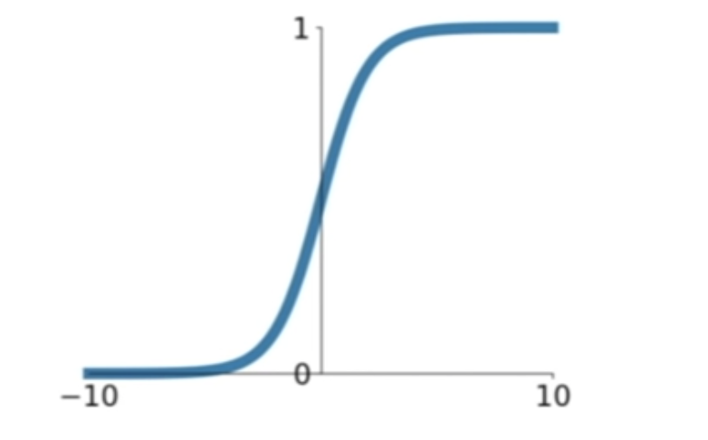

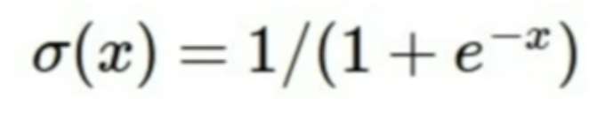

- squashes numbers to range [0, 1]
- Historically popular since they have nice interpretation as a saturating "firing rate" of a neuron
- If you get very high values as input, then output is going to be something near one. if you get very negative  values, it's going to be near zero.


3 problems:

1. Saturated neurons "kill" the gradients
   - 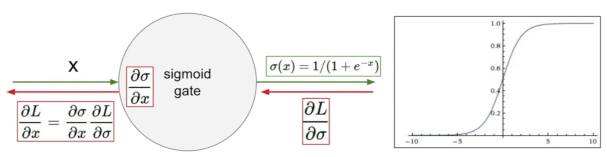
   - what happens when x = -10? => gradient is 0
   - What happens when x = 0? => get reasonable gradient, and then it'll be fine for backprop.
   - what happens when x = 10? => gradient is 0
2. Sigmoid outputs are not zero-centered
   - if input to a neuron is always positive, it's going to be multiplied by some weight, W, and then we're going to run it through our activation function. so what can we say about the gradients on W? it's always all positive or all negative. they're always going to move in the same direction. 
   - So this gives very inefficient gradient updates.
3. exponential is a bit compute expensive
   - in the grand scheme of your network, this is usually not the main problem, because we have all these convolutions and dot products that are a lot more expensive, but this is just a minor point also to observe.


**tanh**

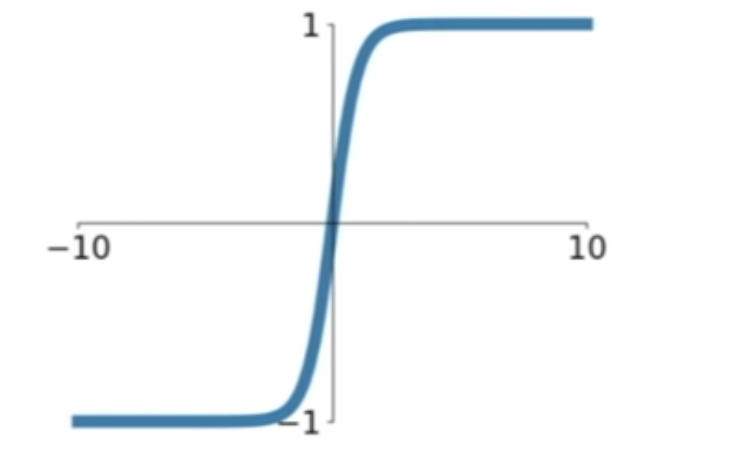

- squashes numbers to range [-1, 1]
- zero centered -> nice
- it still kills gradients when saturated 


**ReLU**

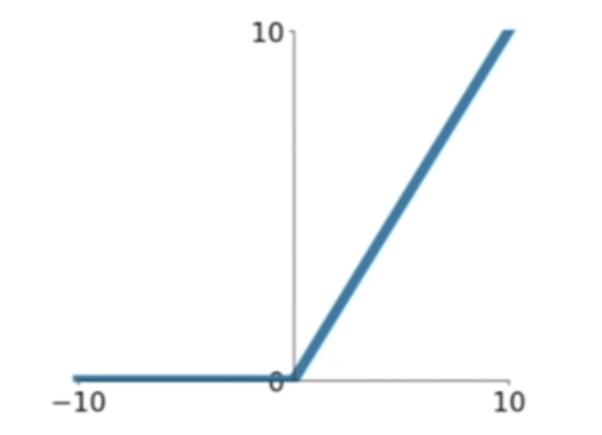

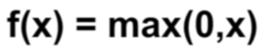

- Does not saturate in positive region
- Very computationally efficient
- converges much faster than sigmoid/tanh in practivce
- actually more biologically plausible thant sigmoid


2 problems:

1. not zero-cetnered output
2. in the positive half of the inputs, we don't have saturation, but this is not the case of the negative half.
   - 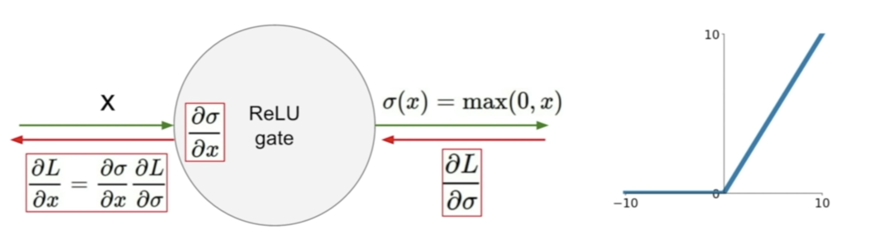
   - what happens when x = -10? => gradient is 0
   - What happens when x = 0? => it undefined here, but in practice, we'll say zero
   - what happens when x = 10? => it's good. in the linear regime.

Dead ReLU

- in this bad part of the regime.
- it will never activate and never update,as compared to a n active ReLU where some of the data is going to be positive and passed through and some won't be.
- you can look at this in, as coming from several potential reasons.
  1. When you have bad initialization. then they're never going to get a data input that causes it to activate, and so they're never going to get good gradient flow coming back.
  2. when your learning rate is too high. and so this case you started off with an okay ReLU, but because you're making these huge updates, the weights jump around and then your ReLU unit in a sense, gets knocked off of the data manifold.
- so if in practice,if you freeze a network that you've trained and you pass the data through, you can see it actually is much as 10 to 20% of the network is these dead ReLUs.


Q: how do you tell when the ReLU is going to be dead or not with respect to the data cloud?

A: it's whatever the weights happended to be, and where the data happens to be is where these hyperplanes fall, and so, throughout the course of training, some of your ReLUs will be in different places, with respect to the data cloud.


Q: for the sigmoid we talked about two drawbacks, and one of them was that the neurons can get saturated, but it is not the case, when all of your inputs are positive?

A: so when all of your inputs are positive, they're all going to be coming in this zero plus region here, and so you can still get a saturating neuron, because you see up in this positive region, it also plateaus at one, and so when it's when you have large positive values as input your're also going to get the zero gradient, 


So in practice people also like to initialize ReLUs with slightly positive biases, in order to increase the likelihood of it being active at initialization and to get some updates.


**Leaky ReLU**

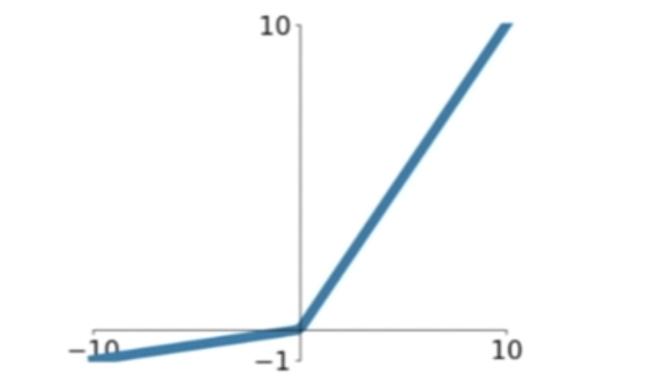

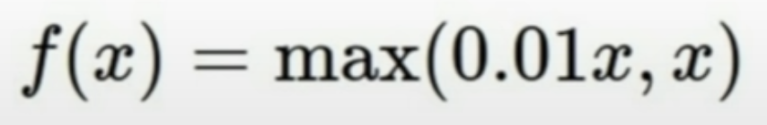

- Does not saturate
- computationally efficient
- converges much faster than sigmoid/tanh in practice!
- will not "die"


**PReLU**

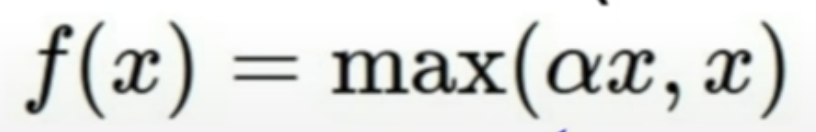

- the slope in the negative regime is determined through this alpha parameter, so we don't specify but we treat it as now a parameter
- so this gives it a little bit more flexibility


**ELU**

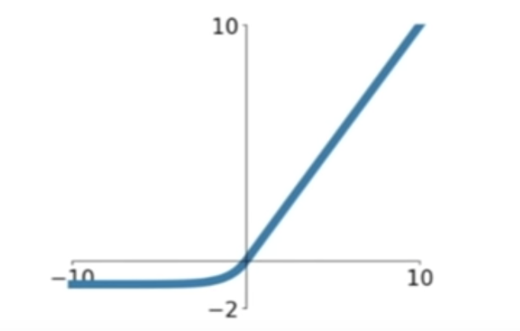

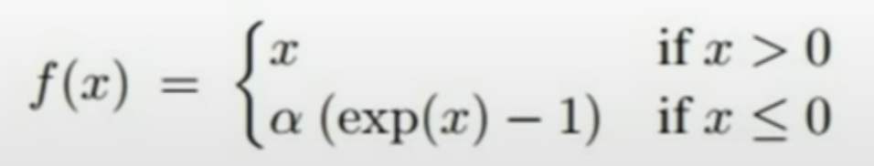

- Has all benefits of ReLU
- closer to zero mean outputs
- negative saturation regime compared with Leaky ReLU adds some robustness to noise


problem

- computation requires exp()


Q: whether this parameter alpha is going to be specific for each neuron

A: I believe it is often specified but i actually can't remember exactly.


**Maxout**

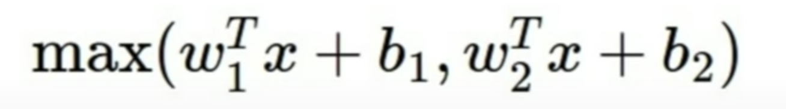

- does not have the basic form of dot product -> nonlinearity
- generalizes ReLU and Leaky ReLU. because just taking the max over theses two linear functions.
- operating in a linear Regime
- doesn't saturate and it doesn't die


problem

- doubles the number of parameters/neuron


### Data processing

**Step 1 : Preprocessing the data**

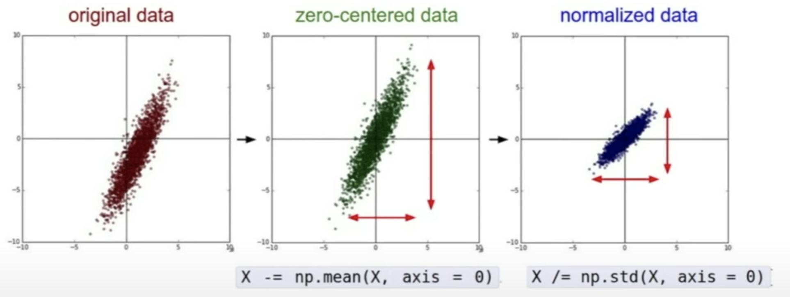

- zero-centered: consider what happens when the input to a neuron is always positive
  - gradients on W is always all positive or all negative
- normalizing: all features are in the same range, and so that they contribute equally.


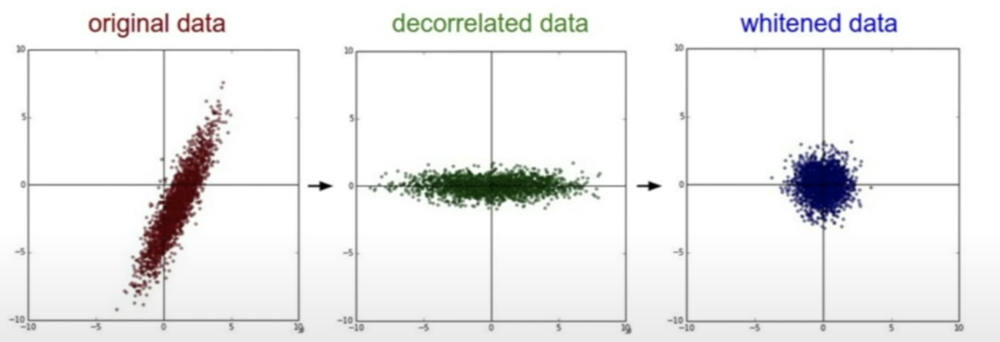

- in practice, you may also see PCA and Whitening of the data
- we typically just stick with the zero mean, and we don't do the normalization


one reason for this is generally with images we don't really want to take all of our input, let's say pixel values and project this onto a lower dimensional space of new kinds of features that we're dealing with. we typically just want to apply convolutional networks spatially and have our spatial structure over the original image.


Q: we do this pre-processing in a training phase, do we also do the same kind of thing in the test phase?

A: yes. in general on the training phase is where we determine our mean, and then we apply this exact same mean to the test data. so, we'll normalize by the same empirical mean from the training data.


Q: what's a channel in this case, when we are subtracting a per-channel mean?

A: this is RGB. our images are typically for example, 32 by 32 by 3. So width, height, each are 32, and our depth we have 3 channels RGB.


Q: when we're subtracting the mean image, what is the mean taken over?

A: the mean is taking over all of your training images. So you'll take all of your training images and just compute the mean of all of those.


Q: we do this for the entire training set, once before we start training, we don't do this per batch?

A: that's exactly correct. we just want to have a good sample, an empirical mean that we have. so if you take it per batch, if you're sampling reasonable batches, it should be basically getting the same values anyways for the mean, and so it's more efficient and easier just do this once at the beginning. you might not even have to really take it over the entire training data. you could also just sample enough training images to get a good estimate of your mean.


Q: does the data preprocessing solve the sigmoid problem?

A: the data preprocessing is doing zero mean. and we talked about how sigmoid, we want to have zero mean. so it does solver this for the first layer that we pass it through. but in deep network, this is not going to be sufficient.


### Weight Initialization

Q1: what happens when W=0 init is used?

- problem is all the neurons will do the same thing.
  - since your weights are zero, given an input, every neuron is going to have the same operation basically on top of your inputs. and so, since they're all going to output the same thing, they're also all going to get the same gradient. and they're all going to update in the same way. and now you're just going to get all neurons that are exactly the same, which is not you want.


Q: because the gradient also depends on our loss, won't one backprop differently compared to the other?

A: in the last layer,  like yes, you do have basically some of this, the gradient will get different loss for each specific neuron based on which class it was connected to, but if you look at all the neurons generally throughout your network, you basically have a lot of these neurons that are connected in exactly the same way. they had the same updates and it's basically going to be the problem.


-> First idea: **Small random numbers**

(Gaussian with zero mean and 1e-2 standard deviation)

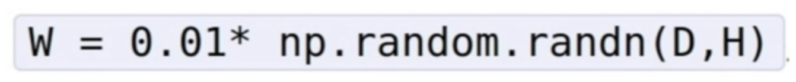

- this does work okay for small networks, but problems with deeper networks.

```python
# assume some unit gaussian 10-D input data
D = np.random.randn[1000, 500]
hidden_layer_sizes = [500]*10
nonlinearities = ['tanh']*len(hidden_layer_sizes)

act = {'relu':lambda x:np.maximum(0,x), 'tanh':lambda x:np.tanh(x)}
Hs = {}
for i in range(len(hidden_layer_sizes)):
  X = D if i == 0 else Hs[i-1] # input at this layer
  fan_in = X.shape[1]
  fan_out = hidden_layer_sizes[i]
  W = np.random.randn(fan_in, fan_out) * 0.01 # layer initialization
  
  H = np.dot(X, W) #matrix multiply
  H = act[nonlinearities[i]](H)
  Hs[i] = H # cache result on this layer
  
# look at distributions at each layer
print 'input layer had mean %f and std %f' % (np.mean(D), np.std(D))
layer_means = [np.means(H) for i, H in Hs.iteritems()]
layer_stds = [np.std(H) for i, H in Hs.iteritems()]
for i, H in Hs.iteritems():
  print 'hidden layer %d had mean %f and std %f' % (i+1, layer_means[i], layer_std[i])
  
# plot the means and standard deviations
plt.figure()
plt.subplot(121)
plt.plot(Hs.keys(), layer_means, 'ob-')
plt.title('layer mean')
plt.subplot(122)
plt.plot(Hs.keys(), layer_stds, 'or-')
plt.title('layer std')

# plot the raw distributions
plt.figure()
for i, H in Hs.iteritems():
  plt.subplot(1, len(Hs), i+1)
  plt.hist(H.ravel(), 30, range=(-1, 1))
```

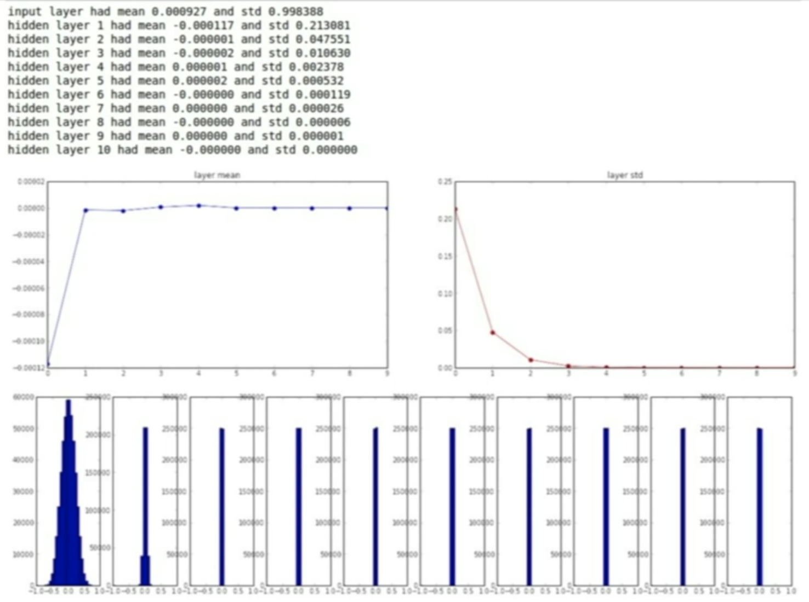

- the means are always around zero.
- the standard deviation shrinks and it quickly collapses to zero.
- all activations become zero


Q1: think about the backward pass. what do the gradients look like?

A: we have our input values are very small at each layer, because they've all collapsed at this near zero, and then now each layer, we have our upstream graidnet flowing down, and then in order to get the gradient on the weights  dot product were doing W times X. it's just basically going to be X, which is our inputs. so because X is small, our weights are getting a very small gradient, and they're bascially not updating.


upstream is the gradient flow from your loss, all the way back to your input. and so upstream is what came from what you've already done, flowing down into your current node.


-> Second idea: **big random numbers**

```python
# ~~~~
W = np.random.randn(fan_in, fan_out) * 1.0 # layer initialization
# ~~~~~
```

smaple from this standard gaussian, now with standard deviation 1.0 instead of 0.01

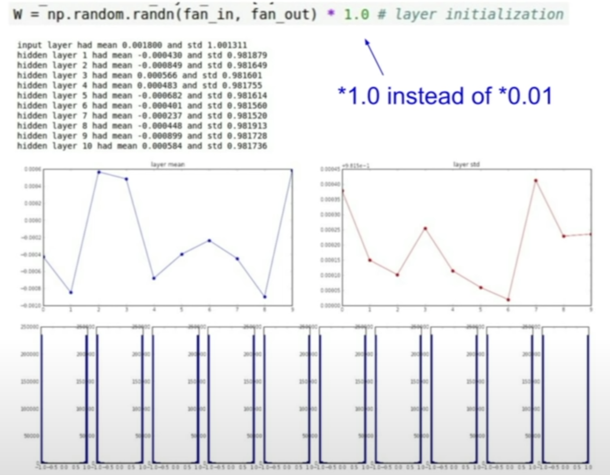

- because our weights are going to be big, we're going to always be at saturated regimes of either very negative or very positive of the tanh.
- when they're saturated, that all the gradients will be zero, and our weights are not updating.


**Xavier initialization**

```python
# ~~~~
W = np.random.randn(fan_in, fan_out) / np.sqrt(fan_in) # layer initialization
# ~~~~
```

1. Using tanh

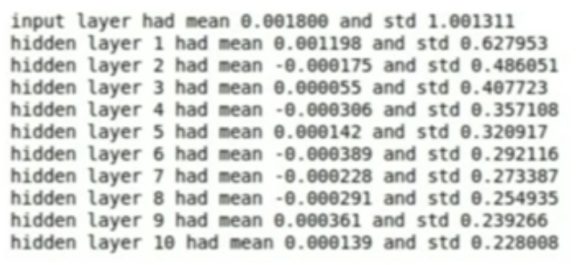

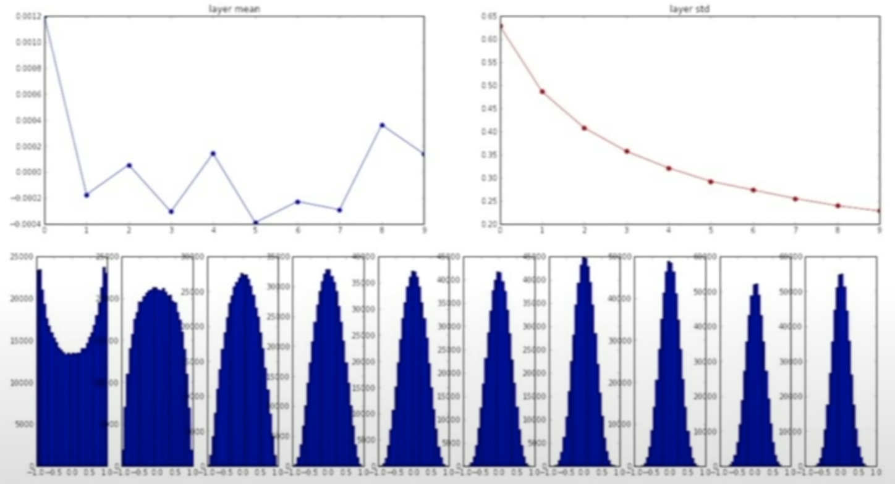

- sample from our standard gaussian, and then we're going to scale by the number of inputs that we have.
- the variance of the input to be the same as a variance of the output
- intuitively with this kind of means is that if you have a small number of inputs, then we're going to divide by the smaller number and get larget weights, because with small inputs, and you're multiplying each of these by weight, you need a larger weights to get the same larger variance at output. and kind of vice versa for if we have many inputs, then we want smaller weights in order to get the same spread at the output.


2. ReLU

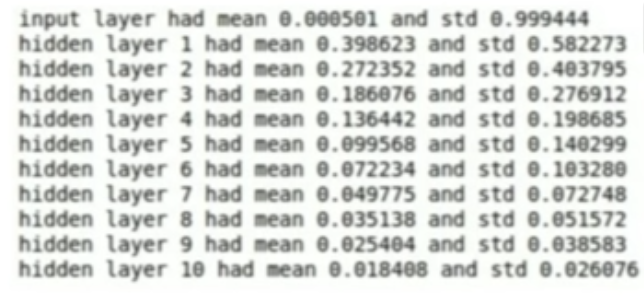

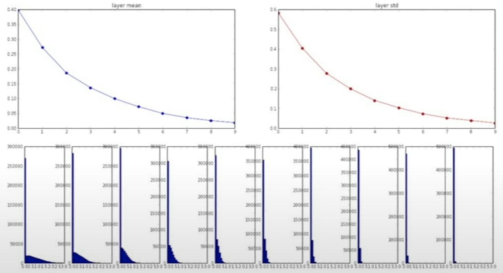

- when using the ReLU, nonlinearity it breaks.
- Because it's killing half of your units, it's setting approximately half of them to zero at each time, it's actually halving the variance that you get out of this.
- the distributions starts collapsing. in this case you get more and more peaked toward zero, and more units deactivated.