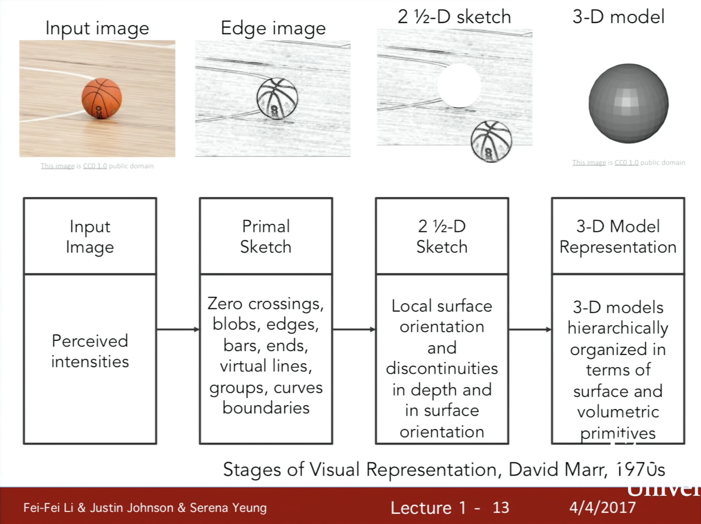
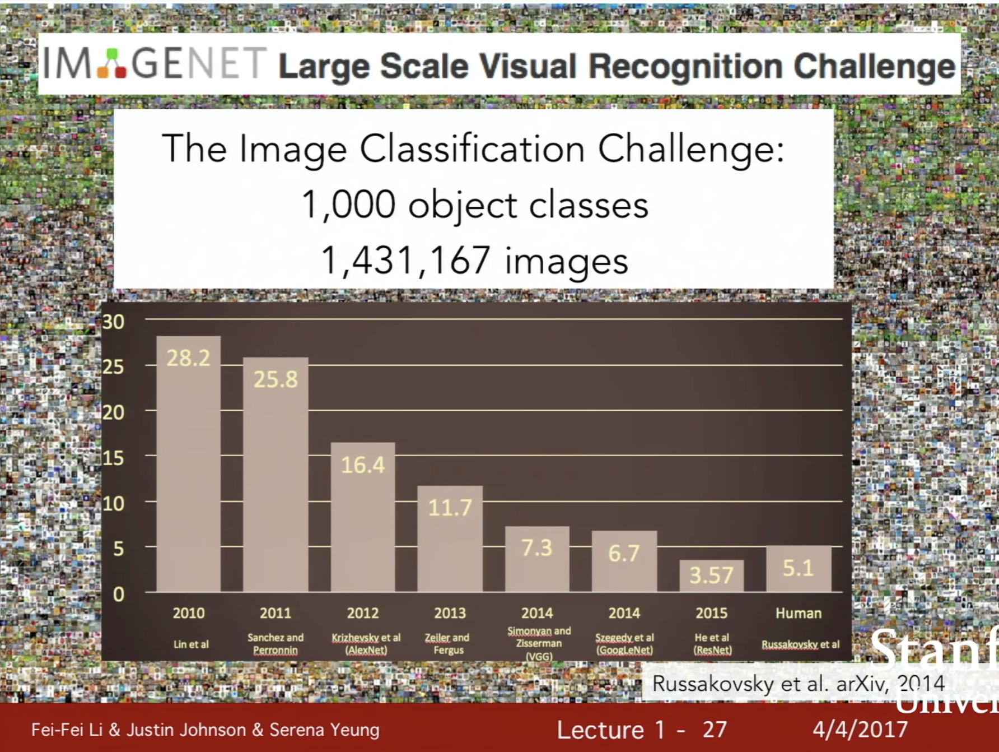

# Lecture 1 | Introduction to Convolutional Neural Networks for Visual Recognition

visual data : the dark matter of the internet in analogy with dark matter in physics.

- In physics, dark matter accounts for some astonishingly large fraction of the mass in the universe, and we know about it due to the existence of gravitational pulls on various celestial bodies and what not, but we can't directly observe it.
- Visual data on the internet is much the same.
- Where it comprises the majority of bits flying around the internet, but it's very difficult for algorithm to actually go in and understand and see what exactly is comprising all the visual data on the web.

 

Field of computer vision is truly an interdisciplinary field, and it touches on many different areas of science and engineering and technology.

- Physics

  - Optics
    - to understand optics and image formation and how images are actually physically formed.

- Biology, Psychology

  - Neuroscience

  - Cognitive sciences
    - to understand how animal brains phsically see and process visual information.

- Computer Science

  - Graphics, Algorithms, Theory,...
  - Systems, Architecture
  - Information retrieval
  - Machine learning
    - to build computer systems that implement our computer vision algorithms.

- Engineering

  - Robotics
  - Speech, NLP
  - Image processing

 

### A brief history of computer vision

From fossil studies zoologist found out within a very short period of time - ten million years - the number of animals species just exploded. 

- It went from a few of the to hundreds of thousands.
- What caused this?
  - There are many theories but for many years it was a mystery.

A few years ago an Australian zoologist called Andrew Parker proposed one of the most convincing theory from the studies of fossils he discovered around 540 million years ago the first animals developed eyes and the onset of vision stated this explosive speciation phase.

Vision has developed into the biggest sensory system of almost all animals especially intelligent animals. In humans almost 50% of the neurons in our cortex involved in visual processing.

Biologist started studying the mechanism of vision. One of the most influential work in both human vision where animal vision as well as that inspired computer vision is the work done by Hubel and Wiesel in the 50s and 60s using eletrophysiology. What they were asking, the question is "What was the visual processing mechanism like in primates, in mammals". So they chose to study cat brain which is more or less similar to human brain from a visual processing point of view. what they discovered is visual processing starts with simple structure of the visual world, oriented edges and as information moves along the visual processing pathway the brain builds up the complexity of the visual information until it can recognize the complex visual world.

 

[ Block world ] Larry Roberts, 1963

- probably the first PhD thesis of computer vision.
- the goal is to be able to recognize them and reconstruct what these shapes are.

 

[ The Summer Vision Project ] MIT, 1966

- the goal is an attempt to use our summer workers effectively in a consturction of a significant part of a visual system.
- the field of computer vision has blossomed from one summer project.

 

< VISION > David Marr, 1970s

- the thought process in the book is that in order to take an image and arrive at a final holistic full 3d representation of the visual world is below.
- first process is what he calls "primal sketch". This is where mostly the edges, the bars, the ends, the virtual lines, the curves, boundaries, are represented
- the next step is what he calls "two-and-a-half d sketch". this is where we start to piece together the surfaces, the depth information, the layers, or the discontinuites of the visual scene.
- And then eventually we put everything together and have a 3d model.
- 

 

[ Generalized Cylinder ] Brooks & Binford, 1979

[ Pictorial Structure ] Fischler and Elschlager, 1973

- People began to ask the question "how can we move beyond the simple block world and start recognizing or representing real world objects?" in 1970s.
- the next basic idea of the works is that every object is composed of simple geometric primitives.

 

[ Normalized Cut ] Shi & Malik, 1997

- the basic idea is if object recognition is too hard, maybe we should first do object segmentation.
- taking an image and group the pixels into meaningful areas.

 

[ Face Detection ] Viola & Jones, 2001

- using AdaBoost algorithm to do real-time face detection.

 

[ "SIFT" & Object Recofnition ] David Lowe, 1999

- feature based object recognition
- the idea is that to match and recognize the entire object. This is hard because there might be all kinds of changes due to camera angles, occlusion, viewpoint, lighting, and just the intrinsic variation of the object itself.
- it inspired to observe some features. So the tasks of object recognition began with identifying these critical features on the object and then match the features to a similar object.

 

[ Spatial Pyramid Matching ] Lazebnik & Schmid &Ponce, 2006

- the idea is that there are features in the images that can give us clue about which type of scene it is.
- this particular work takes theses features from different parts of the image and in different resolutions and put them together in a feature descriptor and then we do support vector machine algorithm on top of that.

 

[ Hitogram of Gradients (HoG) ] Dalal & Triggs, 2005

[ Deformable Part Model ] Felzenswalb & McAllester & Ramanan, 2009

- How we can compose human bodies in more realistic images and recognize them.

 

growth of the internet, the digital cameras were having better and better data to study compute vision.

One of the outcomes is the field of computer vision has defined a very important building block problem to solve. it's not the only problem to solve but in terms of recognition this is a very important problem to solve which is object recognition.

 

in the early 2000s we began to have benchmark data set that can enable us to measure the progress of object recognition.

One of the most influential benchmark data set is called PASCAL Visual Object Challenge, and it's a data set composed of 20 object classes. 

 

from Prinston to Stanford ask: Are we ready to recognize every object or most of the object in the world.

- most of the machine learning algorithms very likely to overfit in the training process
- part of the problem is visual data is very complex
  - because it's complex, our models tend to have a high dimension of input and have to have a lot of parameters to fit and when we don't have enough training data overfitting happens very fast and the we cannot generalize very well.

motivated by dual reason.

- one is just want to recognize the world of all the objects
- the other one is to overcome the machine learning bottleneck of overfitting

this project called ImageNet.

the end result is a ImageNet of almost 15 million or 40 million plus images organized in 22000 categories of objects and scenes.

 

 one particular moment should notice on this graph is the year 2012.

- in the first two years, error rate hovered around 25%
- but in 2012 the error rate was dropped more almost 10%p to 16%
- winning algorithm of that year is a convolutional neural network model.

 

ImageNet Large Scale Visual Recognition Challenge

- year 2010: NEC-UIUC (CVPR 2011)
- year 2012: SuperVision(==AlexNet)  (NIPS 2012)
- year 2014: GoogleNet, VGG (arrive 2014)
- year 2015: MSRA(==Residual Networks)

 

one of the sort of foundational works in this area of convolutional neural networks was actually in the '90s from Jan LeCun and collaborators

there's a couple really key innovations that happened that have changed since the '90s.

- computation
  - 10^6 -> 10^9 transistor
  - GPU
- data
  - in the '90s there just wasn't that much labeled data available.

