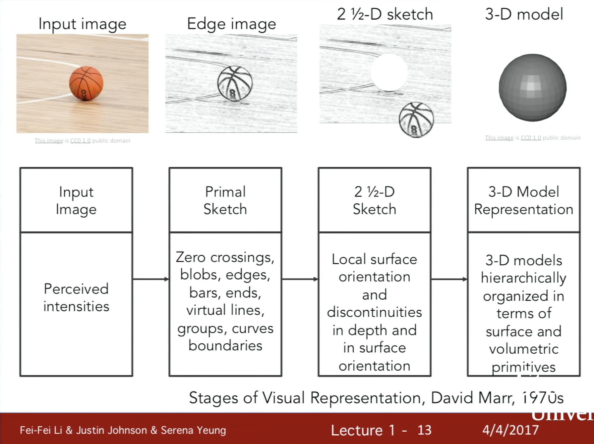
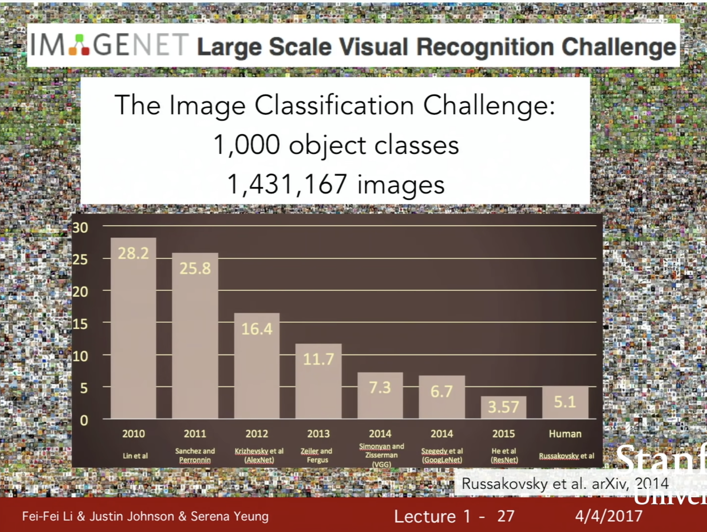

# Lecture 1 | Introduction to Convolutional Neural Networks for Visual Recognition

시각적 데이터: 물리학의 암흑 물질과 유사하다고 비유되는 인터넷의 암흑 물질이다.

- 물리학에서, 암흑물질은 놀랍게도 우주의 질량의 큰 부분을 차지한다. 우리는 다양한 천를 끌어당기는 중력의 존재 때문에 암흑 물질에 대해 알고 있지만, 직접적으로 관찰할 수는 없다.
- 인터넷 상에 있는 시각적인 데이터 역시 그와 같다.
- 인터넷으로 전송되는 비트의 대부분을 구성하지만, 알고리즘으로 웹의 모든 시각적 데이터를 찾고 정확히 무엇을 구성하고 있는지 이해하는 것은 매우 어렵다.

 

컴퓨터 비전 분야는 여러 학문 분야가 관련된 분야로, 이공계 및 기술의 여러 분야를 다루고 있다.

- 물리학
  - 광학
    - 광학 및 이미지 형성과 실제로 어떻게 이미지가 형성되는지를 이해한다.
- 생물학, 심리학
  - 신경 과학
  - 인지 과학
    - 동물의 뇌가 시각적인 정보를 어떻게 보고 처리하는지를 이해한다.
- 컴퓨터 공학
  - 그래픽, 알고리즘, 이론 등
  - 시스템, 아키텍쳐
  - 정보 검색
  - 머신 러닝
    - 컴퓨터 시스템을 구축하고 컴퓨터 비전 알고리즘을 적용한다.
- 공학 기술
  - 로보틱스
  - 음성, 자연어처리
  - 이미지 처리

 

### 컴퓨터 비전의 간략한 역사

화석 연구에서 동물학자들은 천만년의 시간 중에서 굉장히 짧은 시간동안 동물의 종 수가 폭발적으로 증가했음을 발견했다.

- 몇 개에서 수십만 개로 늘어났다.
- 무엇이 원인일까?
  - 수 많은 이론들이 있지만 오랫동안 미스테리였다.

 

몇 년 전 앤드류 파커라는 호주의 동물학자는 화석 연구 분야에서 굉장히 설득력있는 이론을 제안했다. 5억 4천만년 전 최초의 동물들은 눈을 발달시켰고 시력의 시작이 폭발적인 특정 단계를 설명함을 발견했다고 했다

시력은 거의 모든 동물들, 특히 지능이 높은 동물들에게 가장 영향력있는 감각 체계로 발전했다. 사람에게서는 거의 50%의 뉴런이 시각 처리에 관여한다.

동물학자들은 시각의 매커니즘에 관해 연구했다. 동물의 시력인 인간의 시력과 컴퓨터 비전에서 가장 영향력 있는 연구 중 하나는 50년대와 60년대에 전기생리학을 이용해 Hubel과 Wiesel이 진행한 연구이다. 그들이 궁금했던 것은, "영장류, 포유류의 시각적 처리 매커니즘은 어떨까?" 였다. 그래서 그들은 시각적 처리 관점에서 사람의 뇌와 거의 비슷한 고양이 뇌에 대한 연구를 결정했다. 그들이 발견한 것은 시각적인 처리는 단순한 시각적 세계의 구조, 지향적인 가장자리부터 시작해 시각적인 처리를 경로를 따라 복잡한 시각적 세계를 인식할 수 있을 때까지 시각적 정보의 복잡성을 증가시킨다는 것이다

 

[ Block world ] Larry Roberts, 1963

- 아마 컴퓨터 비전의 첫번째 박사 논문일 것이다
- 대상을 인식하고 그 모양들이 무엇인지 재구성하는 것이 목표

 

[ The Summer Vision Project ] MIT, 1966

- 목표는 ""우리의 여름 근로자들을 시각적 시스템의 중요한 부분에 효과적으로 이용하려는 시도다."라고 적혀있다.
- 컴퓨터 비전 분야을 꽃피우게 한 여름 프로젝트

 

< VISION > David Marr, 1970s

- 사진을 찍어 최종적으로 전체적인 3d 표현을 하기 위한 사고 과정
- 첫번째 과정은 "pimal sketch"라고 칭한다. 가장자리, 막대, 끝단, 가상선, 곡선, 경계 등이 대부분 표현된다.
- 다음 과정은 "2 1/2-D sketch"라고 칭한다. 표면, 깊이 정보, 층, 또는 시각적 장면의 불연속적인 부분을 합치기 시작한다.
- 그리고 최종적으로 모든 것을 합치고 3d 모델을 만들어낸다.
- 

 

[ Generalized Cylinder ] Brooks & Binford, 1979

[ Pictorial Structure ] Fischler and Elschlager, 1973

- 1970년대에 사람들은 "어떻게 하면 단순한 블록 세계를 넘어 실제 사물들을 인식하거나 표현할 수 있을까?"라는 질문을 하기 시작했다.
- 연구들의 기본적인 사고는 모든 물체는 단순한 기하학적 원리로 구성되어 있다는 것이다.

 

[ Normalized Cut ] Shi & Malik, 1997

- 기본적인 사고는 만약 물체 인식이 어렵다면, 아마 우리는 물체 분할부터 시작해야 한다는 것이다.
- 사진을 찍어 픽셀을 의미있는 영역으로 그룹화

 

[ Face Detection ] Viola & Jones, 2001

- 실시간 face detection을 위해서 AdaBoost 알고리즘을 사용했다.

 

[ "SIFT" & Object Recofnition ] David Lowe, 1999

- 특징 기반의 물체 인식
- 전체 물체를 일치시키고 인식하는 것이 기본적인 사고이다. 카메라의 각도, 폐색, 가시점, 조명 그리고 물체 자체의 고유한 변화로 가지는 모든 종류의 변화 때문에 어려울 것이다.
- 특징들을 관찰할 수 있도록 영감을 주었다. 그래서 물체 인식은 대상에서 이러한 중요한 특징들을 식별하고 비슷한 물체와 일치시키는 것을 시작하게 되었다.

 

[ Spatial Pyramid Matching ] Lazebnik & Schmid &Ponce, 2006

- 기본적인 사고는 어떤 유형의 장면인지 단서가 될 수 있는 특징이 있다는 것이다.
- 이 특별한 연구는 이미지의 각 다른 부분과 다른 해상도에서 특징을 취하고 특징 서술자에 합성한 다음 최종적으로 벡터 머신 알고리즘으로 뒷받침한다.

 

[ Hitogram of Gradients (HoG) ] Dalal & Triggs, 2005

[ Deformable Part Model ] Felzenswalb & McAllester & Ramanan, 2009

- ''어떻게 하면 인간의 몸을 보다 현실적인 이미지로 구성하고 인식할 수 있을까"에 대한 연구들

 

인터넷과 디지털 카메라의 발전은 컴퓨터 비전 연구를 하는데 있어 더 좋은 데이터를 가질 수 있게 했다.

그 결과들 중 하나는 컴퓨터 비전 분야가 해결해야 할 매우 중요한 빌딩 블록 문제를 정의했다는 것이다. 이것이 해결해야 할 유일한 문제는 아니지만 인식의 측면에서 어떤 것이 물체 인식인지를 해결하는 것은 매우 중요하다.

 

2000년대 초반에 물체 인식의 진행 상황을 측정할 수 있게 하는 기준 데이터를 가지게 되었다.

가장 영향력있는 기준 데이터 중 하나는 PASCAL Visual Object Challenge라고 불리고 20가지 객체 클래스로 구성되어 있다.

 

프린스턴부터 스탠포드 등의 학교에서는 "우리가 세계의 모든 또는 대부분의 물체를 인식할 준비가 되었나?"라는 질문을 하기 시작했다.

- 대부분의 머신 러닝 알고리즘은 학습 단계에서 overfit하기 매우 쉽다.
- 일부 문제는 시각 데이터가 너무 복잡하다는 것이다.
  - 그 복잡성 때문에, 우리의 모델을 매우 높은 차원의 입력값을 가지는 경향이 있고 맞춰야할 많은 매개변수를 가지게 된다. 또 우리가 충분한 학습 데이터를 가지고 있을 않을 때 overfitting은 빠르게 발생하고 우리가 쉽게 일반화할 수 없다.

아래 두가지 이유에 의해 자극을 받았다.

- 첫째는 단순히 세상의 모든 물체를 인식하고 싶다.
- 둘째는 overfitting의 머신 러닝 병목현상을 극복하고 싶다.

그래서 진행한 이 프로젝트는 ImageNet이라 한다.

ImageNet의 최종 결과 4,000만개 이상의 이미지와 22,000개의 물체 및 장면으로 분류되는 이미지들이다.

 

이 그래프에서 주목해서 봐야할 부분은 2012년이다.

- 처음 2년간은 오류율은 약 25%이었다.
- 하지만 2012년에 오류율은 10%p가 떨어져 16%가 되었다.
- 그 해에 수상한 알고리즘은 convolutional neural network 모델이었다.

 

ImageNet Large Scale Visual Recognition Challenge

- year 2010: NEC-UIUC (CVPR 2011)
- year 2012: SuperVision(==AlexNet)  (NIPS 2012)
- year 2014: GoogleNet, VGG (arrive 2014)
- year 2015: MSRA(==Residual Networks)

 

convolutional neural network 분야의 기초적인 연구는 사실 1990년대에 LeCun과 협력자들에 의해 진행되었었다.

1990년대와는 달리 convolutional neural network가 빛을 보게 된 몇가지 큰 변화들이 있다.

- 계산 능력
  - 10^6 -> 10^9 트랜지스터로 향상
  - GPU 등장
- 데이터
  - 90년대에는 분류된 데이터가 그리 많지 않았다.