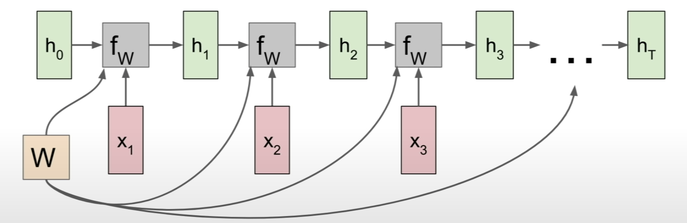

# Lecture 10 | Reccurent Neural Networks

- one-to-many
  - e.g. Image Captioning: image -> sequence of words
- many-to-one
  - e.g. Sentiment Classification: sequence of words -> sentiment
- many-to-many
  - e.g. Machine translation: seq of words -> seq of words
- many-to-many
  - e.g. Video classification on frame level

"DRAW: A Recurrent Neural Network For Image Generation" [Gregor et al] <ICML 2015>

- the model to synthesize brand new images that look kind of like the images it swa in training, and we can use a recurrent neurla network architecture to actually paint theses output images sort of one piece at a time in the output.
- you can see that, even thought our output is fixed size image, we can have these models that are working over time to compute parts of the output one at a time sequentially.

### Recurrent Neural Network

- 
- has little recurrent core cell
- take some input x, feed that input into the RNN, and that RNN has some internal hidden state, and that internal hidden state will be updated every time that the RNN reads a new input. and that internal hidden state will be then fed back to the model the next time it reads an input.
- 
- the same function and the same set of parameters are used at every time step.
- 
- 

