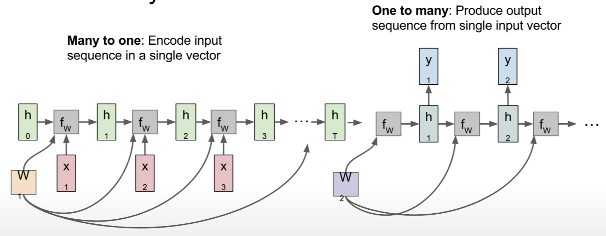
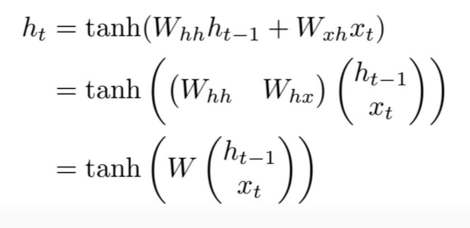

# Lecture 10 | Reccurent Neural Networks

- one-to-many
  - e.g. Image Captioning: image -> sequence of words
- many-to-one
  - e.g. Sentiment Classification: sequence of words -> sentiment
- many-to-many
  - e.g. Machine translation: seq of words -> seq of words
- many-to-many
  - e.g. Video classification on frame level

"DRAW: A Recurrent Neural Network For Image Generation" [Gregor et al] <ICML 2015>

- the model to synthesize brand new images that look kind of like the images it swa in training, and we can use a recurrent neurla network architecture to actually paint theses output images sort of one piece at a time in the output.
- you can see that, even thought our output is fixed size image, we can have these models that are working over time to compute parts of the output one at a time sequentially.

### Recurrent Neural Network

- 
- has little recurrent core cell
- take some input x, feed that input into the RNN, and that RNN has some internal hidden state, and that internal hidden state will be updated every time that the RNN reads a new input. and that internal hidden state will be then fed back to the model the next time it reads an input.
- 
- the same function and the same set of parameters are used at every time step.
- 
- 

### Sequence to Sequence

- like machine translation, where you take a variably sized input and a variably sized output.
- many-to-one + one-to-many => encoder & decoder
- if you're the encoder, we'll receive the variably sized input, which might be your sentence in English and then sunmarize that entire sentence using the final hidden state of the encoder network.
- and then we have a second decoder network, which will input that single vector summarizing the input sentence and now produce this variably sized output, which might be your sentence in another language.
- 

### Character-level Language Model

- Where the network will read some sequence of characters and then it needs to predict what will the next character be in this stream of text?
- Ex) Vocabulary: [h, e, l, o]
- example training sequence "hello"
- 
- 

Q: why might we sample instead of just taking the character with the largest score?

A: in this case, because of the probability distribution that we had, it was impossible to get the right character. so we had the sample so the example could work out. but in practice, sometimes you'll see both. so sometimes you'll just take the argmax probability, and that will sometimes be a little bit more stable. but on advantage of sampling, in general, is that it lets you get diversity from you models. sometimes you might have the same input, maybe the same prefix, but then if you sample rather than taking the argmax, then you'll see that somtimes these trained models are actually able to produce multiple different types of reasonable output sequences, depending on which samples they take at the first time steps.

Q: in test time, could we feed in the whole softmax vector instead of a one hot vertor?

A: there's kind og two problems with that. One is that that's very different from the data that it saw at training time. in general, if you ask your model to do something at test time, which is different from training time, then it'll usually blow up. the other problem is that in practice, our vocabularies might be very large.

### Backpropagation through time

- forward through entire sequence to compute loss, then backward through entire sequence to compute gradient
- in the forware pass, you're kind of stepping forward throught time and then during the backward pass, you're sort of gogin backwards through time to compute all your gradients.
- this can actually be kind of problematic if you want to train the sequences that are very, very long.

### Truncated Backpropagation through time

- run forward and backward through chunks of the sequence instead of whole sequence.
- carry hiddent states forward in time forerever, but only backpropagate for some smaller number of steps.
- 

Q: is this king of making the Mark Hobb assumption?

A: no, not really. because we're carrying this hidden state forward in time forever. it's making a Marcovian assumption in the sense that, conditioned on the hidden state, but the hidden state is all that we need to predict the entire future of the sequence. but that assumption is kind of built into the recurrent neural network formula from the start. and that's not really particular to back propagation through time.

### Image Captioning

- the caption is this variably lenght sequence might have different numbers of words for different captions.
- Convolution networks will produce a summary vector of the image which will then feed into the first time step of one of these recurrent neural network language models which will then produce words of the caption one at a time.

### Image Captioning with Attention

RNN focueses its attention at a different spatial location when generating each word

1. input image
2. convolutional feature extraction
3. RNN with attention over the image
4. Word by word generation

"Show, Attend and Tell: Neural Image Caption Generation with Visual Attention" [Xu et al] <ICML 2015>

- soft attention: we're kind of taking a weighted combination of all features from all image locations
- hard attention: we're forcing the model to select exactly one location to look at in the image at each time step.

### Visual Question Answering

- many-to-one scenario
- our model needs to take as input natual language sequence
- running a recurrent neural network over each element of that input question, to now summarize the input question in a single vector.
- and then we can have a CNN to againg summarize the image
- and combine both the vectore from the CNN and the vector from the question and coding RNN to then predict a distribution over answers.

Q: how are the encoded image and the encoded question vector combined?

A: kind of the simplest thing to do is just to concatenate them and stick them into fully connected layers. sometimes people do slightly fancier things where they might try to have multiplicative interactions between those two vectors to allow a more powerful function. but generally concatenation is kind of a good first thing to try.

### Multilayer RNN

- deeper models tend to perform better for various problem.

### RNN Gradient Flow

- during the backwards pass, we'll receive the deriative of our loss respect to h_t
- gradient flows backward 
  - gradient will flow backward through tanh gate
  - and then it will flow backwards through this matrix multiplication gate.

### Long Short Term Memory (LSTM)

- Slightly fancier recurrence relation for these recurrent neural networks.
- it's really designed to help alleviate this problem of vanishing and exploding gradients.
- kind of design the architecture to have better gradient flow properties.
- we maintain two hidden states at every time step.
- one is this h_t, which is called the hidden state, which is kind of a analogy to the hidden state that we had in the vanilla RNN.
- c_t, called the cell state. the cell state is this vector which is kind of internal, kept inside the LSTM, and it does not really get exposed to the outside world.

- i: input gate. it says how much do we want to input into our cell.
- f: forget gate. how much do we want to forget the cell memory from the previous time step.
- o: output gate. which is how much do we want to reveal ourself to the outside word.
- g: gate gate. it doesn't have a nice name. it tells us how much do we want to write into our input cell.

Q: what about the gradient in respect to w?

A: cause that's ultimately the thing that we care about. at every time step, will take our current cell state as well as our current hidden state and that will give us our local gradeint on w for that time step. so because our cell state, and just in the vanilla RNN case, we'll end up adding those first time step w gradients to compute our final gradient on w.

Q: due to the non linearities, could this still be susceptible to vanishing gradients?

A: that could be the case. one problem you might imagine is that maybe if these forget gates are always less than one, you might get vanishing gradients as you continually go through these forget gates. one sort of trick that people do in pratice is that they will, sometimes, initialize the biases of the forget gate to be somewhat positive. so that at the beginning of training, those forget gates are always very close to one.

