# Lecture 3 | Loss Functions and Optimization


TODO

1. Define a **loss function** that quantifies our unhappiness with the scores across the training data.
2. Come up with a way of effieiently finding the parameters that minimize the loss function(**optimization**)


Example

- Suppose: 3 training examples, 3 classes.
- With some W the scores f(x, W) = Wx
- 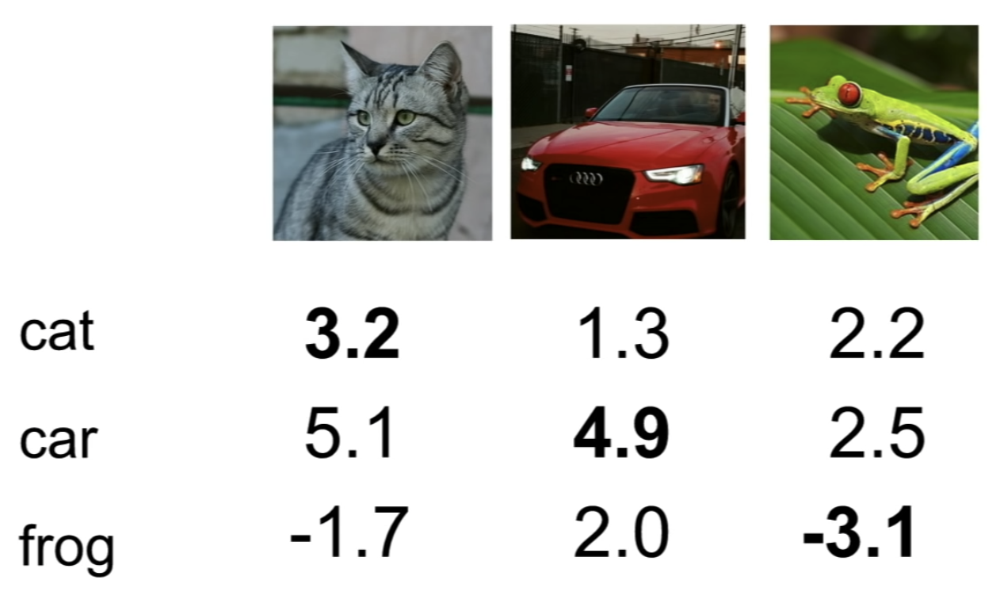


**loss function** tells how good our current classifier is

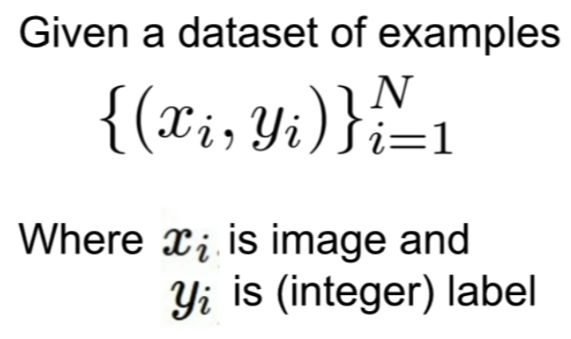

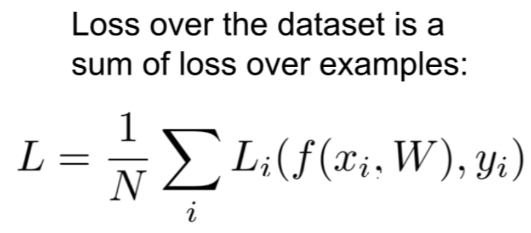


### Multi-class SVM loss

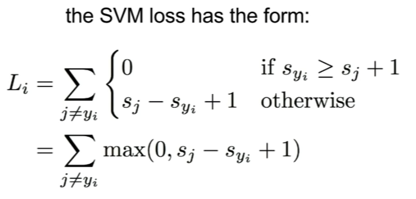

- perform a sum over all of the categories, Y, except for the true category, Y_i
- so, sum over all the incorrect categories and then we're going to compare the score of the correct category, and the score of the incorrect category.
- now if the score for the correct category is greater than the score of the incorrect category(greater than the incorrect score by some safety margin that we set to one), it's means that the score for the true category is much larger than any of the false categories, then we'll get a loss of zero.
- this kind of like "if~then~" statement
- it is often referred to as some type of a hinge loss
  - 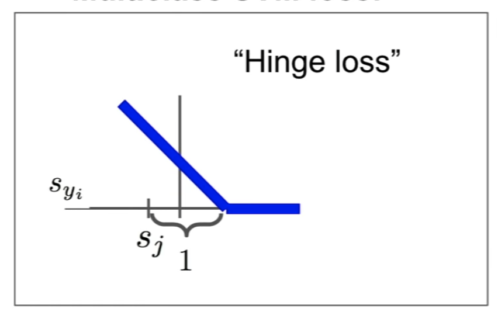


Q: In terms of notation, what is S and what is S_y_i in particular?

A: the S are the predicted scores for the classes that are coming out of the classifier. and that y_i is the category of the ground truth label for the example which is some integer. so S_y_i corresponds to the score of the true class for the i-th example in the training set.


Q: What exactly is this computing here?

A: in some sense, what this loss is saying is that we are happy if the true score is much higher than all the other scores. It needs to be higher than all the other scores by some safety margin. and if the true score is not high enough, greater than any or the other scores, then we will incur some loss and that would be bad.


SVM example


if "cat" is the correct class, so we're going to loop over the car and frog classes

=> L_i = max(0, 5.1 - 3.2 + 1) + max(0, -1.7 - 3.2 + 1)

​			= max(0, 2.9) + max(0, -3.9)

​			= 2.9 + 0 = 2.9


if "car" is the correct class,

=> L_i = max(0, 1.3 - 4.9 + 1) + max(0, 2.0 - 4.9 + 1)

​			= max(0, -2.6) + max(0, -1.9)

​			= 0 + 0 = 0


if "frog" is the correct class,

=> L_i = max(0, 2.2 - (-3.1) + 1) + max(0, 2.5 - (-3.1) + 1)

​			= max(0, 6.3) + max(0, 6.6)

​			= 6.3 + 6.6 = 12.9


L = (2.9 + 0 + 12.9) / 3 = 5.27


Q: how do you choose the plus one?

A: It seems like kind of an arbitrary choice here, it's the only constant that appears in the loss function and that seems to offend your aesthetic sensibilities a bit maybe. but it turns out that this is somewhat of an arbitrary choice, because we don't actually care about the absolute values of the scores in this loss function, we only care about the relative differences between the scores. so in fact if you imagine scaling up your whole W up or down, then it kind or rescales all the scores correspondingly and if you kind of work throught the details and there's a detailed derivation of this in the course notes online, you find this choice of one actually doesn't matter.


Q1: what's going to happen to the loss if we change the scores of the car image just a little bit? 

A: if we jiggle the scores for this car image a little bit, the loss will not change. So the SVM loss, remember, the only thing it cares about is getting the correct score to be greater than one ore than the incorrect scores, but in this case, the car score is already quite a bit larger than the others, so if the scores for this class changed for this example changed just a little bit, this margin of one will still be retained and the loss wil not change.


Q2: what's the min and max possible loss in SVM?

A: min == 0, max == infinity.


Q3: sort of when you initialize these things and start training from scratch, usually you kind of initialize W with some small random values, as a result your scores tend to be sort of small uniform random values at the beginning of training. if all of your Ss, if all of the scores are approximately zero and approximately equal, then what kind of loss do you expect when your're using multiclass SVM?

A: number of classes minus one. Because remember that if we're looping over all of the incorrect classes, so we're looping over (C - 1) classes, within each of those classes the two Ss will be aboute the same, so we'll get a loss of one because of the margin and we'll get C - 1.

if the loss you actually see at the start of training at that first iteration is not equal to C-1, that means you probably have a bug and you should go check your code. so this is actually kind of a useful thing to be checking in practice.


Q4: what happens if the sum is also over the correct class if we just go over everything?(including j=y_i)

A: the loss increases by one. 


Q5: What if we used mean instead of sum?

A: it doesn't change. so the number of classes is going to be fixed ahead of time when we select our data set, so that's just rescaling the whole loss function by a constant, so it doesn't really matter.


Q6: what if we change this loss formulation and we actually added a square term on top of this max?

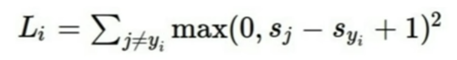

would this end up being the same problem or would this be a different classification algorithm?

A: this would be different.this would end up actually computing a different loss function. this idea of a squared hinge loss actually does get used sometimes in practice, so that's kind of another trick to have in your bag when you're making up your own loss functions for your own problems.


Q: why would you ever consider using a squared loss instead of a non-squared loss?

A: the whole point of a loss function is to kind of quantify how bad are different mistakes. and if the classifier is making different sorts of mistakes, how do we weight off the different trade-offs between different types of mistakes the classifier mght make? so if you're using a squared loss, that sort of says that things that are very bad, are now going to be sqaured bad. whereas if you're using this hinge loss, we don't actually care between being a little bit wrong and being a lot wrong, this idea of using a linear versus a square is a way to quantify how much we care about differenct categories of errors. 


Multi-class SVM loss - Example code

```python
def L_i_vectorized(x, y, W):
	scores = W.dot(x)
  margins = np.maximum(0, scores - scores[y] + 1)
  margins[y] = 0
  loss_i = np.sum(margins)
  return loss_i
```


Q: Suppose that we found a W such that L = 0. is this W unique?

A: No! 2W is also has L = 0!

Ex) 

W : max(0, 1.3 - 4.9 + 1) + max(0, 2.0 - 4.9 + 1)

​	= max(0, -2.6) + max(0, -1.9)

​	= 0 + 0 = 0

2W : max(0, 2.6 - 9.8 + 1) + max(0, 4.0 - 9.8 + 1)

​	= max(0, -6.2) + max(0, -4.8)

​	= 0 + 0 = 0

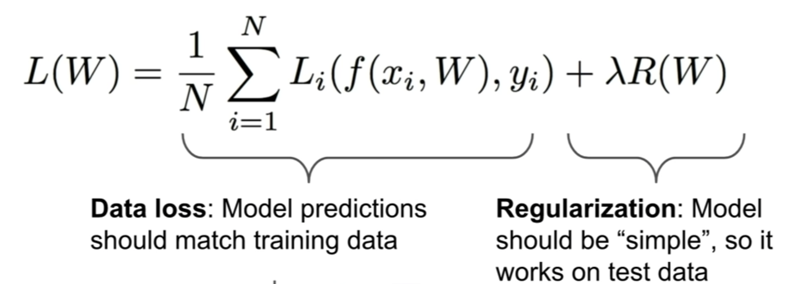

there's this whole idea of Occams' Razor, which is this fundamental idea in scientific discovery more broadly, which is that if you have many different competing hypotheses, that could explain your observations, you should generally prefer the simpler one, because that's the explanation that is more likely to generalize to new observations in the future.


Q: What's the connection between this lambda, R, W term and actually forcing this wiggly line to become a straight green line?

A: i didn't want to go through the derivation on this because i thought it would lead us too far astray, but you can imagine, maybe you're doing a regression problem, in terms of different polynomial basis functions, and if you're adding this regression penalty, maybe the model has access to polynomials of very high degree, but through this regression term you could encourage the model to prefer polynomials of lower degree, if they fit the data properly, or if they fit the data relatively well. either you can constrain your model class to just not contain the more powerful, more complez models, or you can add this soft penalty where the model still has access to more complex models, maybe high degree polynomials in this case, but you add this soft constraint, saying that if you want to use these more complex models, you need to overcome this penalty for using their complexity.


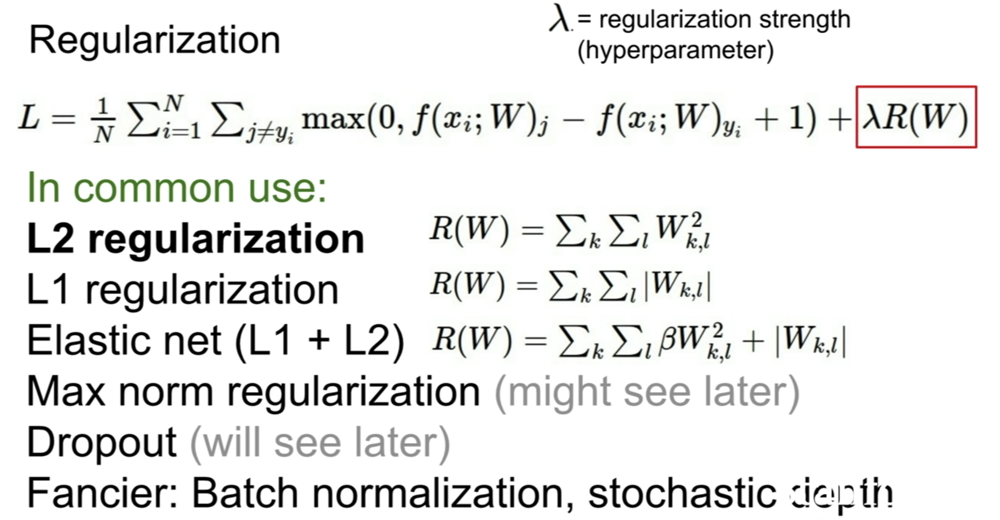

- the idea of L2 regularization is you're just penalizing the euclidean norm of this weight vector.
- the L1 regularization has some nice properties like encouraging sparsity in this matrix W.


Q: how does the L2 regularization measure the complexity of the model?

A: so here we maybe have some training example, x, and there's two different Ws that we're considering. so x is just this vector of four ones, and we're considering these two difference possibilities, one is a single one and three zeros, and the other has this 0.25 spread across the four differenct entries. and now, when we're doing linear classification, we're really taking dot products between our x and our W. so in terms of linear classification, these two Ws are the same, because they give the same result when dot producted with x. if you look at these two examples, which one would L2 regression prefer? L2 regression would prefer W2. because it has a smaller norm.So L2 regularization is saying that it prefers to spread that influence across all the different values in x. and by the way, L1 regularization has this opposite interpretation. 


Q: So why would L1 prefer W1? don't they sum to the same one?

A: yes, you're right. so in this case, L1 is actually the same between these two.but you could construct a similar example to this where W1 would be preferred by L1 regularization. i guess the general intuition behind L1 is that it generally prefers sparse solutions, that it drives all your entries of W to zero for most of the entries, except for a couple where it's allowed to deviate from zero. the way of measuring complexity for L1 is maybe the number of non-zero entries, and then for L2, it thinks that things that spread the W across all the values are less complex. so it depends on your data, depends on your problem.

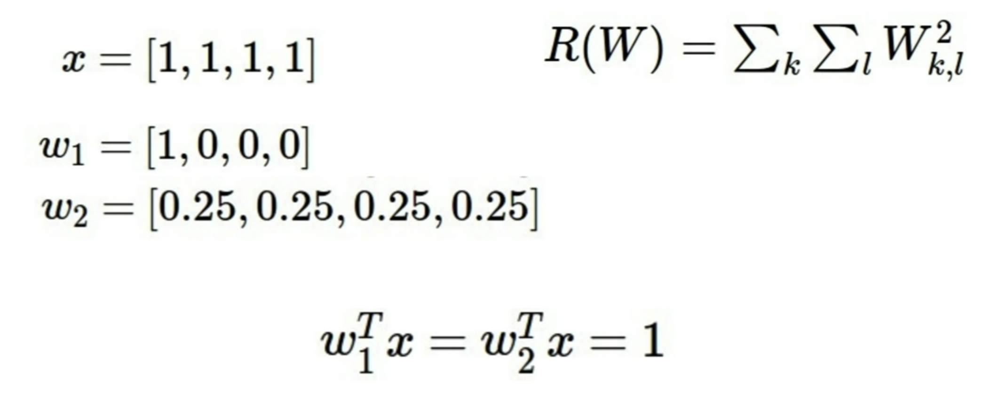

by the way, if you're a hardcore Bayesian, then using L2 regularization has this nice interpretation of MAP inference under a Gaussian prior on the parameter vector.


Q: adding a regularization is not going to change the hypothesis calss? this is not going to change us away from a linear classifier? 

A: maybe this example of this polynomial regression is definitely not linear regression. that could be seen as linear regression on top of a polynomial expansion of the input, and in which case, this regression sort of says that you're not allowed to use as many polynomial coefficients are maybe you should have. so you can imagine this is like, when you're doing polynomial regression, you can write out a polynomial, in that case your parameters, your Ws, would be these As, in which case, penalizing the W could force it towards lower degree polynomials. Except in the case of polynomial regression, you don't actually want to parameterize in terms of As, there's some other parameterization that you want to use, but that's the general idea, that you're sort of penalizing the parameters of the model to force it towards the simpler hypotheses within your hypothesis class.


### Softmax Classifier (Multinomial Logistic Regression)

for the multi-class SVM, we didn't actually give much interpretation to those scores. We just said that we want the true score, the score of the correct class to be greater than the incorrect classes, and beyond that we don't really say what those scores mean.

 But now, for the multinomial logistic regression loss function, we actually will endow those scores with some additional meaning. and in particular we're going to use those scores to compute a probability distribution over our classes. so we use this so-called softmax function where we take all of our scores, we exponentiate them so that now they become positive, then we re-normalize them by the sum of those exponents. so now after we send our scores throught this softmax function, now we end up with this probability distribution, where now we have probabilities over our classes, where each probability is between zero and one, and the sum of probabilities across all classes sum to one. And now the interpretation is that we want, therer's this computed probability distribution that's implied by our scores, and we want to compare this with the target or true probability distribution.

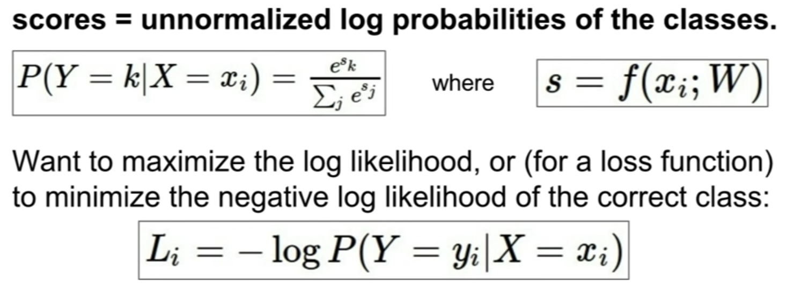


you can do this equation in many ways, you can do this as a KL divergence between the target and the computed probability distribution, you can do this as a maximum likelihood estimate, but at the end of the day, what we really want is that the probability of the true class is high and as close to one.

so then our loss will now be the negative log of the probability of the true class. this is confusing 'cause we're putting this through multiple different things, but remember we wanted the probability to be close to one, so now log is a monotonic function, it turns out mathematically, it's easier to maximize log than it is to maximize the raw probability, so we stick with log. and now log is monotonic, so if we maximize log P of correct class, that means we want that to be high, but loss functions measure badness not goodness so we need to put in the minus one to make it go the right way.


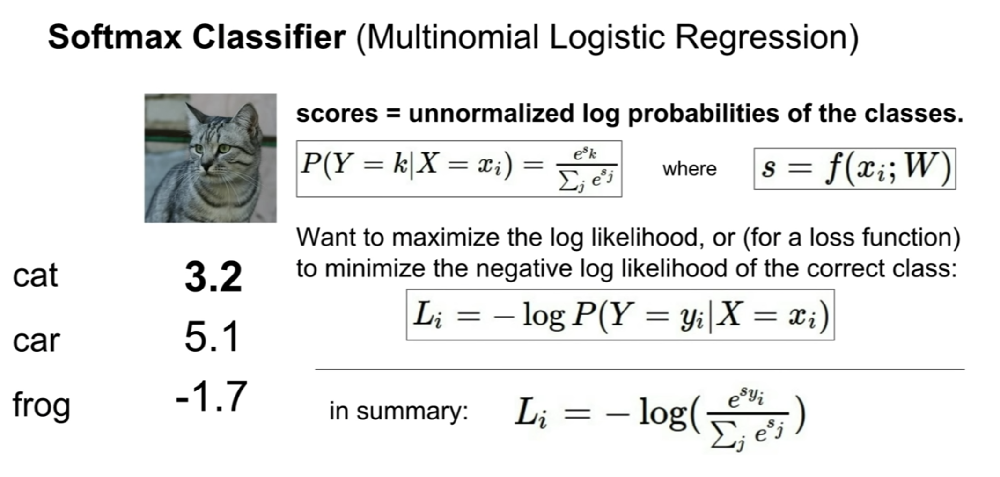

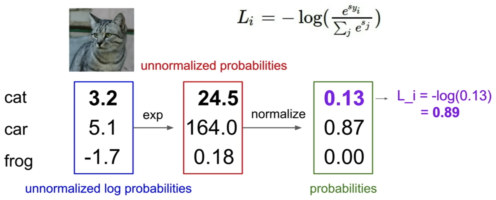


Q1: what's the min and max value of the softmax loss?

A: min=0, max=infinity. And the way that you can see this, the probability distribution that we want is one on the correct class, zero on the incorrect classes, the way that we do that is, so if that were the case, then this thing inside the log would end up being one, because it's the log probability of the true class, then log og one is zero, minus log of one is still zero. so that means that if we got the thing totally right, then our loss would be zero. 

By the way, in order to get the thing totally right, what would our scores have to look like? So the scores would actually have to go quite extreme, like towards infinity. so because we actually have this exponentiation, this normalization, the only way we can actually get a probability distribution of one and zero, is actually putting an infinite score for the correct class, and minus infinity score for all the incorrect classes. and computers don't do so well with infinities, so in practice, you'll never get to zero loss on this thing with finite precision. But you still have this interpretation that zero is the theoretical minimum loss here. and the maximum loss is unbounded. so suppose that if we had zero probability mass on the correct class, then you would have minus log of zero, log of zero is minus infinity, so minus log of zero is plus infinity.so that's really bad.


Q2: If all the Ss are small and about zero, then what is the loss here?

A: minus log of one over c, becuase log can flip the thing so then it's just log of c. and again, this is a nice debugging thing, if you're training a model with this softmax loss, you should check at the first iteration. if it's not log C, then something's gone wrong.

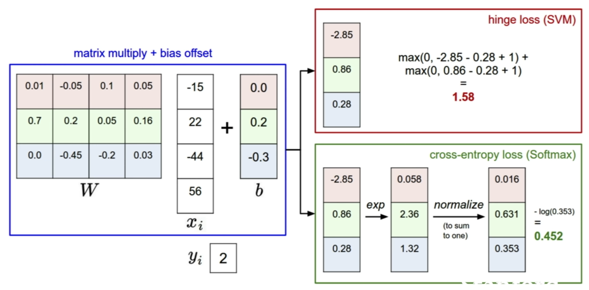


Q3: Suppose i take a datapoint and i jiggle a bit (changing its score slightly). what happens to the loss in both cases?

A: remember if we go back to this example where in the multi-class SVM loss, when we had the car, and the car score was much better than all the incorrect classes, then jiggling the scores for that car image didn't change the multi-class SVM loss at all, because the only thing that the SVM loss cared about was getting that correct score to be greater than a margin above the incorrect scores. but now the softmax loss is actually quite different in this respect. the softmax loss actually always wants to drive that probability mass all the way to one. so even if you're giving very high score to the correct class, and very low score to all the incorrect classes, softmax will want you to pile more and more probability mass on the correct class, and continue to push the score of that correct class up towards infinity, and the score of the incorrect classes down towards minus infinity.


### Optimization

- how do we actually find this W that minimizes the loss?


strategy #1: A first very bad ideq solution: Random Search

```python
# assume X_train is the data where each column is an example (e.g. 3073 x 50,000)
# assume Y_train are the labels (e.g. 1D array of 50,000)
# assume the function L evaluates the loss function

bestloss = float("inf") # Python assigns the highest possible float value
for num in range(10000):
  W = np.random.randn(10, 3073) * 0.0001 # generate random parameters
  loss = L(X_train, Y_train, W)
  if loss < bestloss: # keep track of the best soluttion
    bestloss = loss
    bestW = W
  print 'in attempt %d the loss was %f, best %f' % (num, loss, bestloss)
```


```python
# See how well this works on the test set...
# Assume X_test is [3073 x 10000], Y_test [10000 x 1]
scores = Wbest.dot(Xte_cols) # 10 x 10000, the class scores for all test examples
# find the index with max score in each column (the predicted class)
Yte_predict = np.argmax(scores, axis = 0)
# and calculate accuracy (fraction of predictions that are correct)
np.mean(Yte_predict == Yte)
# returns 0.1555
```


Strategy #2: Follow the slope

- This it generally the strategy that we'll follow when training these large neural networks and linear classifiers and other things.
- what is the slope?
  - in 1-dimension, the derivative of a function
  - in multiple dimensions, the gradient is the vertor of (partial derivatives) along each dimension
  - the slope in any direction is the dot product of the directio with the gradient
  - the direction of steepest descent is the negative gradient

This is actually terrible idea, because it's super slow. so you might imagine that computing this function, f, might actually be super slow if it's a large, convolutional neural network.

so in practice, you'll never want to compute your gradients for your finite differences, 'cause you'd have to wait for hundreds of millions potentially of function evaluations to get a single gradient, and that would be super slow and super bad.

-> Use calculus to compute an **analytic gradient** 

- it'll be exact
- It'll be much faster since we just need to compute this single expression


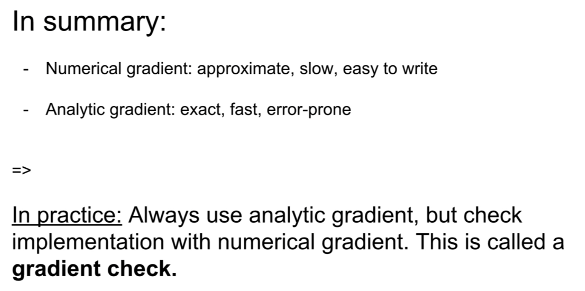


however, numerical gradients are actually a very useful debuggin tool. a really common debuggin strategy for these things is to use the numeric gradient as a way as sort of unit test to make sure that your analytic gradient was correct. 


### Gradient Descent

```python
# Vanilla Gradient Descent

while True:
  weights_grad = evaluate_gradient(loss_fun, data, weights)
  weights += - step_size * weights_grad 
  # perform parameter update in the opposite of the gradient direction
  # step_size if a hyper-parameter
```


if we're using the image net data set for example, then N cloud be like 1.3 million, so actually computing this loss could be actually very expensive and require computing perhaps millions of evaluations of this function. and actually, because the gradient is a linear operator, when you actually try to compute the gradient of this expression, you see that the gradient of our loss is now the sum of the gradient of the losses for each of the individual terms. so if we want to compute the gradient, it sort of requires us to iterate over the entire training data set all N of these examples. so if our N was like a million, this would be super super slow.

So in practice, we tend to use what is called stochastic gradient descent, where rather than computing the loss and gradient over the entire training set, instead at every iteration, we sample some small set of training examples, called a minibatch. Usually this is a power of two by convention, like 32, 64, 126 are common numbers, and then we'll use this small minibatch to compute an estimate of the full sum, and an estimate of the true gradient. 

### Stochastic Gradient Descent (SGD)

```python
# Vanilla Minibatch Gradient Descent

while True:
  data_batch = sample_training_data(data, 256) # sample 256 examples
  weights_grad = evaluate_gradient(loss_fun, data_batch, weights)
  weights += - step_size * weights_grad # perform parameter update
```


### Aside: Image Features

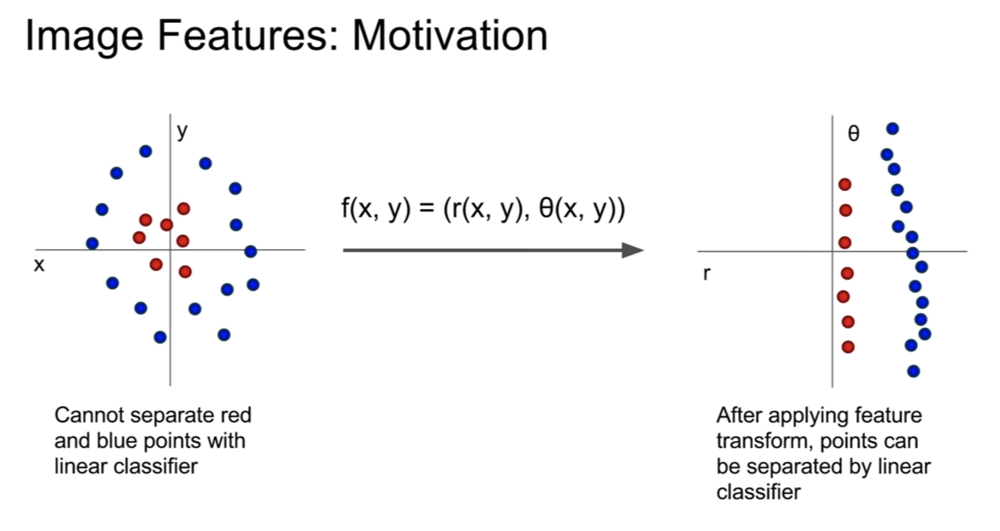

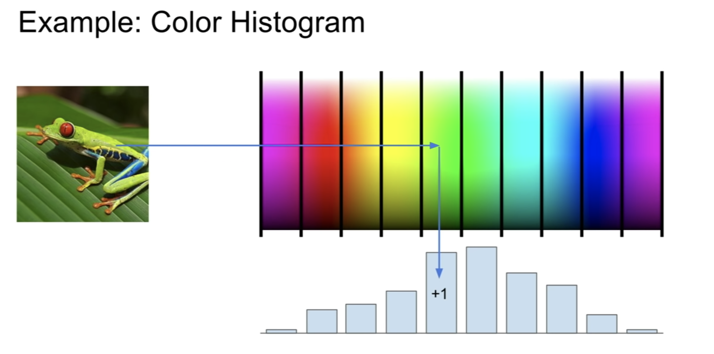

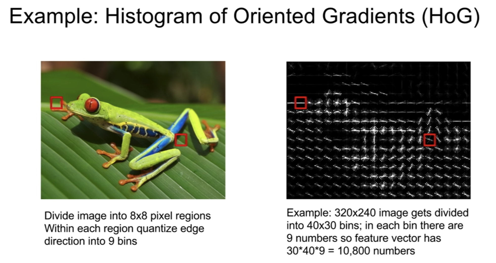

