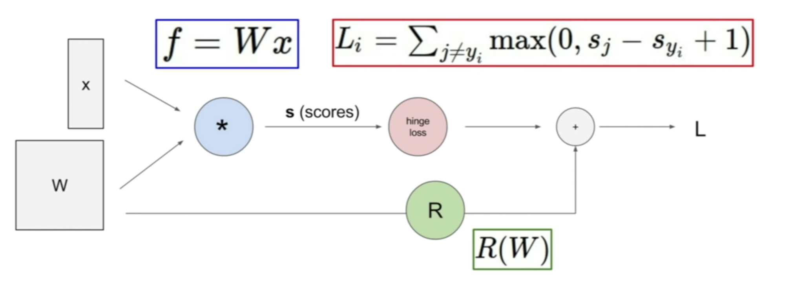
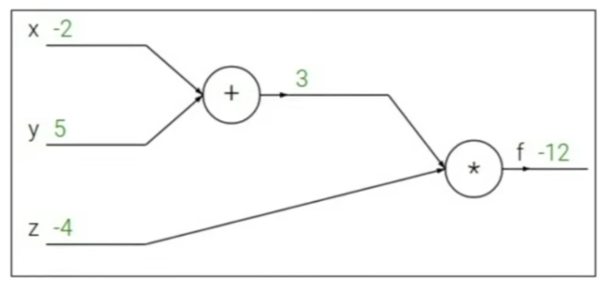
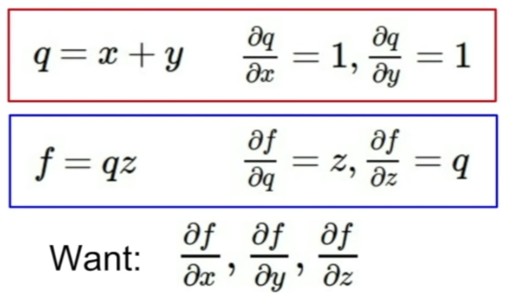
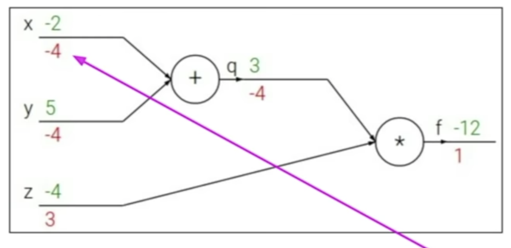
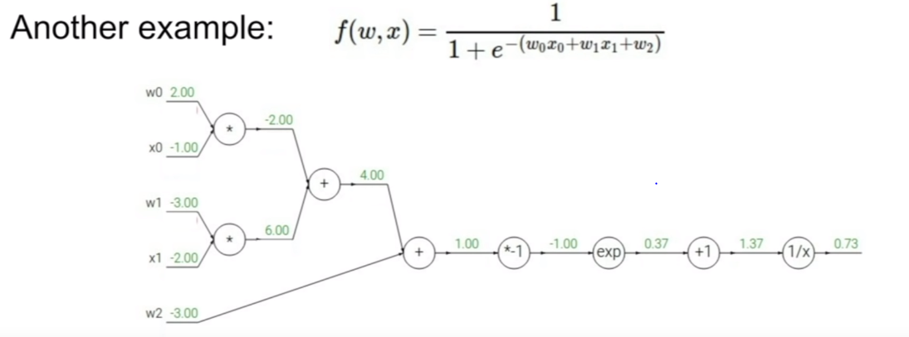
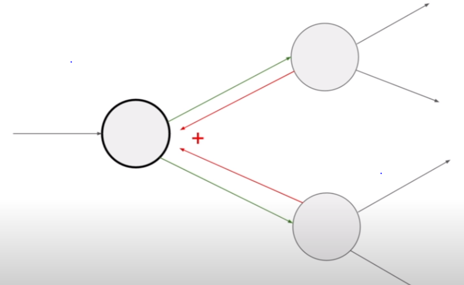

# Lecture 4 | Introduction to Neural Networks


TODO

- how to compute the analytic gradient for arbitrarily complex functions

 

### Gradient descent

1. Numerical gradient
   - pros:
     - easy to write
   - cons:
     - slow
     - approximate
2. Analytic gradient
   - pros:
     - fast
     - exact
   - cons:
     - error-prone


### Computational graphs



- the advantage is that once we can express a function using a computational graph

  then we can use a technique that we call backpropagation whitch is going to recursively use the chain rule in order to compute the graident with respect to every variable in the computational graph


### Backpropagation



- forward : (-2 + 5) * (-4) = -12

- 

  

- bakcward :

   


Q: Can you go back and explain why more in the last slide was different than planning the first part of it using just normal calculus?

A: we can do calculate in the example because it's simple, but we'll see examples later on where once this becomes a really complicated expression. you don't want to have to use calculus to derive the gradient for something for a super-complicated expression, and instead, if you use  this formalism and you break it down into these computational nodes, then you can only ever work with gradients of very simple computations.


during backprop, we'll start from the back of the graph.

when we reach each node, at each node we have the upstream gradients coming back with respect to the immediate output of the node. so by the time we reach this node in backprop, we've already computed the gradient of our final loss L, with respect to z.

we have from the chain rule, that the gradient of this loss function with respect to x is going to be the gradient with respect to z times, compounded by local gradient of z with respect to x.

so in chain rule we always take this upstream gradient coming down, and we multiply it by the local gradient in order to get the gradient with respect to the input


Q: whether this only works because we're working with the current values of the function that we plug in but we can write an expression for this still in terms of the variables?

A: So we'll see that gradient of L with respect to z is going to be some expression, and gradient of z with respect to x is going to be another expression. but we plug in the values of these numbers at the time in order to get the value of the gradient with respect to x. so as you said, basically this it going to be just a number coming down, and then we just multiply it with the expression that we have for the local gradient.




- we're going to start at the very end of the graph, and so here again the gradient of the output with respect to the last variable is just one, it's just trivial.
- once we had these expressions for local gradients, all we did was plug in the values for each of these that we have and use the chain rule to numerically multiply this all the way backwards and get the gradients with respect to all of the variables.


Q: This is a question on the graph itself, is there a reason that the first two multiplication nodes and the weights are not connected to a single addition node?

A: they could also be connected into a single addition node, you can do that if you want. in this case i just wrote this out into as simple as possible, where each node only had up to two inputs.

n

### Patterns in backward flow

"add" gate : gradient distributor

	- pass the exact same thing to both of the branches that were connected.

"max" gate : gradient router

- just take the gradient and route it to one of the branches.

"mul" gate : gradient switcher

- take the upstream gradient and scale it by the value of the other branch.




- it's going to afect bothof these connected nodes in the forward pass
- so then when you're doing backprop, both of these gradients coming back are going to affect this node
- so that's how we're going to sum these up to be the total upstream gradient flowing back into this node


Q: we haven't done anything yet to update the values of these weights, we've only found the gradients with respect to the variables

A: yes, we've talked about so far in this lecture is how to compute gradients with respect to any variables in our function


### Gradients for vectorized code

- everything stays exactly the same, the entire flow, the only difference is that noew our gradients are going to be Jacobian matrices
- Jacobian matrix == the matrix containing the derivative of each element


### Vectorized operations

for example:

- 4096-d input vector
- 4096-d output vector
- node: f(x) = max(0, x) (elementwise)


Q1: what's the size of our Jacobian matrix?

A: the Jacobian matrix is a matrix of partial derivatives of each dimension of the output with respect to each dimension of the input.. so the answer was 4096 squared(4096 x 4096)


in practice this is going to be even larger because we're going to work with many batches of, for example, 100 inputs at the same time, and we'll put all of these through our node at the same time to be more efficient so this is going to scale this by 100. 


Q2: what does Jacobian matrics look like?

A: it's diagonal. so because this is element-wise, each element of the input, the first dimension, only affects that corresponding element in the output and so because of that our Jacobian matrix, which is just going to be a diagonal matrix


 

the gradient of a vector is always going to be the same size as the original vector, and each element of this gradient is going to mean how much of this particular element affects our fianl output of the function.

and the gradient with respect to a variable should have the same shape as the variable.


### Modularized implementation: forward / backward API

```python
class ComputationalGraph():
    # ...
    def forward(inputs):
        # 1. [pass inputs to input gates...]
        # 2. forward the computational graph:
        for gate in self.graph.nodes_topologically_sorted():
            gate.forward()
        return loss # the final gate in the graph outputs the loss
    def backward():
        for gate in reversed(self.graph.nodes_topologically_sorted()):
            gate.backward() # little piece of backprop (chain rule applied)
        return inputs_gradients
```

```python
class MultiplyGate():
    def forward(x, y):
        z = x*y
        self.x = x # must keep these around!
        self.y = y
        return z
    def backward(dz):
        dx = self.y * dz # [dz/dx * dL/dz]
        dy = self.x * dz # [dz/dy * dL/dz]
        return [dx, dy]
```


### Summary

- neural nets will be very large: impractical to write down gradient formula by hand for all parameters
- <b>backpropagation</b> = recursive application of the chain rule along a computational graph to compute the gradients of all inputs/parameters/intermediates
- implementations maintain a graph structure, where the nodes implement the forward()/backward() API
- forward: compute result of an operation and save any intermediates needed for gradient computation in memory
- backward: apply the chain rule to compute the gradient of the loss function with respect to the inputs


### Neural networks: without the brain stuff

(Before) Linear score function: f = Wx

(Now) 2-layer Neural Network: f = W_2max(0, W_1x)


whether in W_1 you could have both left-facing horse and right-facing horse, and so W_1 can be many different kinds of templates and then W_2 it's a weighted sum of all of these templates. so now it allows you to weight together multiple templates in order to get the final score for a particular class.


 Q: if our images x is like a left-facing horse and in W_1 we ahve a template of a left-facing horse and a right-facing horse, then what's happening?

A: in h(middle layer) you might have a really high score for your left-facing horse, kind of a lower score for your right-facing horse, and W_2 is a weighted sum, it's not a maximum. it's a weighted sum of these templates, but if you have eighter a really high score for one of these templates, or let's say you have, kind of a lower and medium score for both of these templates, all of these kinds of combinations are going to give high scores. and so in the end what you're going to get is something that generally scores high when you have a horse of any kind.


Q: is W_2 doing the weighting or is h doing the weighting?

A: W_2 doing the weighting. h is the value of scores for each of your templates that you have in W_1


Q: which is the non-linear thing?

A: the non-linearity usually happens right before h, so h is the value right after the non-linearity.


### Example feed-forward computation of a neural network


```python
class Neuron:
    # ...
    def neuron_tick(inputs):
        """ assume inputs and weights are 1-D numpy arrays and bias is a number """
        cell_body_sum = np.sum(inputs * self.weights) + self.bias
        firing_rate = 1.0 / (1.0 + math.exp(-cell_body_sum)) # sigmoid activation function
        return firing_rate
```

```python
# forward-pass of a 3-layer neural network:
f = lambda x: 1.0/(1.0 + np.exp(-x)) # activation function (use sigmoid)
x = np.random.randn(3, 1) # random input vector of three numbers (3x1)
h1 = f(np.dot(W1, x) + b1)
h2 = f(np.dot(W2, h1) + b2)
out = np.dot(W3, h2)
```

