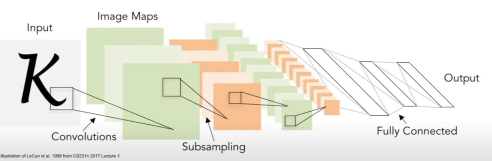
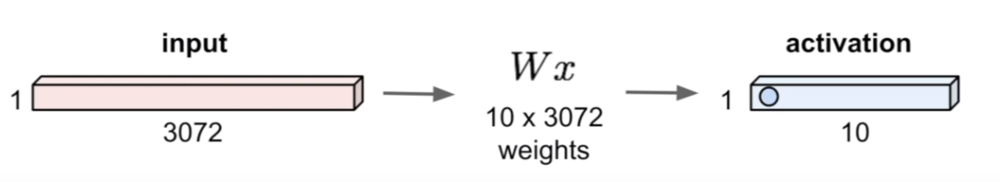
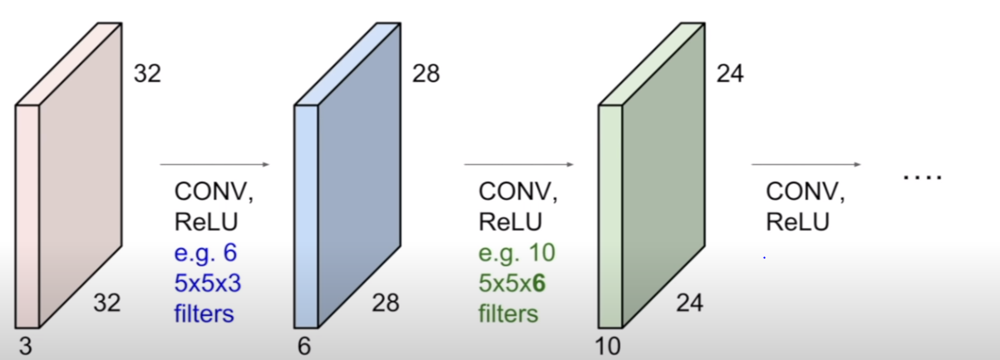
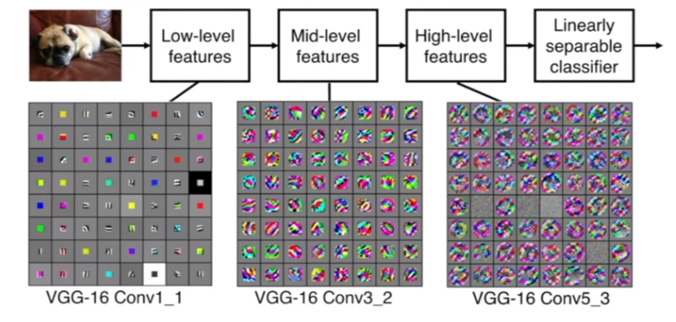
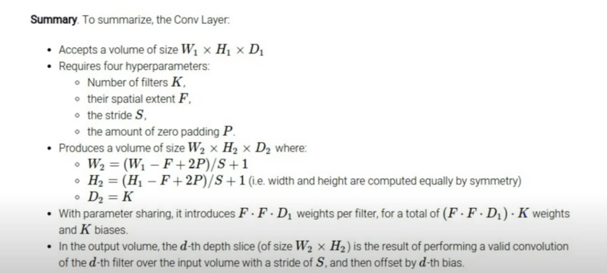
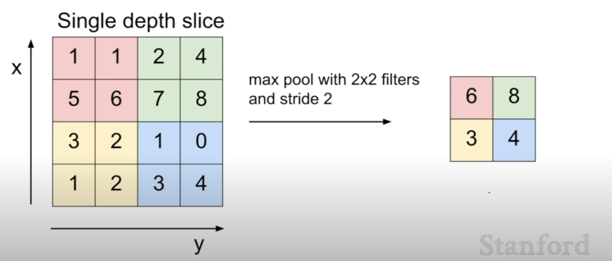
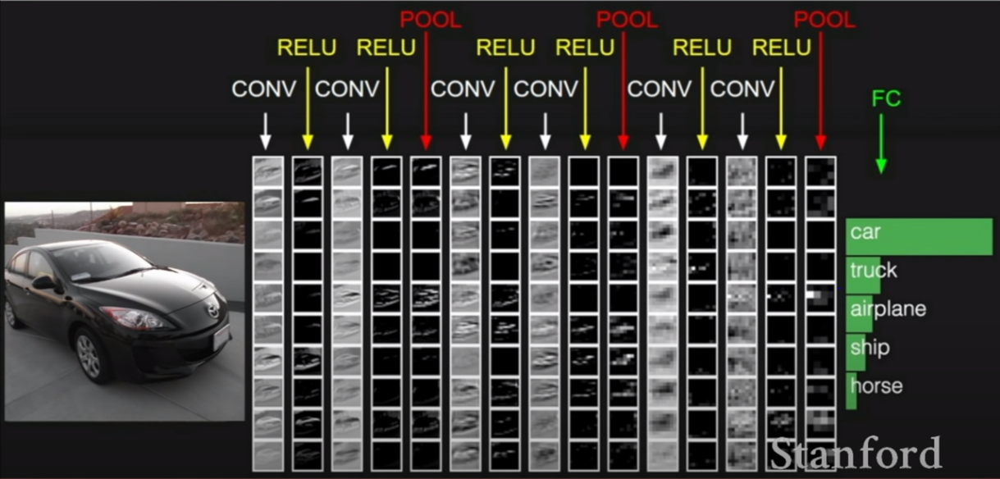

# Lecture 5 | Convolutional Neural Networks

### Convolutional Neural Networks

### A bit of history

- 1957, Frank Rosenblatt
  - developed the Mark 1 perceptron machine, which was the first implementation of an algorithm called the perceptron, which had sort of the similar idea of getting score functions.
  - but the outputs are going to be either one or a zero.
  - have an update rule for weights W, which also look kind of similar to the type of update rule that we're also seeing in backprop, but in this case there was no principled backpropagation technique. just sort of took the weights and adjusted them in the direction towards the target that we wanted.
- 1960, Widrow and Hoff
  - developed Adaline and Madaline, which was the first time to start to stack these linear layers into multilayer perceptron networks
  - but still didn't have backprop or any sort of principled way to train this.
- 1986, Rumelhart
  - first time to introduce backpropagation.
- 2006, Geoff Hinton and Ruslan Salakhutdinov
  - basically showed that we could train a deep neural network and show that we could do this effectively.
  - but it was still not quite the sort of modern iteration of neural networks.
  - it required really careful initialization in order to be able to do backprop, so they would have first pre-training stage, where you model each hidden layer through this kind of, a restricted Boltzmann machine, and get some initialized weights by training each of these layers iteratively.
- 2012, Geoff Hinton's lab
  - acoustric modeling and speech recognition.
  - for image recognition, from Alex Krizhevsky in Geoff Hinton's lab, which introduced the first convolutional neural network architecture that was able to do get really stron results on ImageNet classification.

### Fully Connected Layer

### Convolution Layer

- Convolve the filter with the image
  - small filter, for example 5x5x3 filter, slide it over the image, for example 32x32x3 size, spatially and compute dot products at every spatial location.
- Filters : always extend the full depth of the input volume, and just a smaller spatial area of inpute image

Q: when we do the dot product do we turn the 5x5x3 into one vector?

A: yes, in essence that's what you're doing.

Q: any intuition for why this is a W transpose?

A: this is just not really. this is just the notation that we have here to make the math work out as a dot product. 

Q: should we rotate the kernel by 180 degrees to better match the definition of a  convolution?

A: we'll show the equeation for this later, but we're using convolution as kind of a looser definition of what's happening. so for people from signal processing, what we are actually technically doing, if you want to call this a convolution, is we're convolving with the flipped version of the filter.bur fot the most part, we just don't worry about this and we just do this operation and it's like a convolution in spirit.

when we're dealing with a convolutional layer, we want to work with multiple filters, because each filter is kind of looking for a specific type of template or concept in the input volume.

ConvNet is a sequence of Convolutional Layers, interspersed with activation functions.

where the filters at the earlier layers usually represent low-level features that you're looking for. things kind of like edges.

and then at the mid-level, you're going to get more complex kinds of features, it's looking more for things like corners and blobs and so on.

and then at higher-level features, you're going to get things that are starting to more resemble concepts than blobs.

Q: what's the intuition for increasing the depth each time?

A: this is mostly a desing choice. people in practice have found certain types of these configurations to work better.

Q: what are we seeing in these visualizations?

A: each of these grid, each part of this grid is a one neuron. and so what we've visualized here is what the input looks like that maximizes the activation of that particular neuron. so what sort of image you would get that would give you the largest value, make that neuron fire and have the largest value. 

### Closer look at spatial dimensions

- take 7x7 image, 3x3 filter  => 5x5 output

- take 7x7 image, 3x3 filter with stride 2  => 3x3 output

- take 7x7 image, 3x3 filter with stride 3  => doesn't fit! it lead to assymetirc outputs happening

- output size: (N - F) / stride + 1
  - N: image size
  - F: filter size

### In practice: Common to zero pad the border

- pad our input image with zeros, and so now you're going to be able to place a filter centered at the upper right-hand pixel location of your actual input image. 

Q1: if i have 7x7 image, 3x3 filter, stride 1, but now i pad with a one pixel border, what's the size of my output going to be?

A: 7

Q: how does this connect to before when we had a 32 by 32 b three input?

A: our input had depth and here in this example showing a 2D example with no depth. but in practice you're going to multiply throughout the entire depth as we had before. so 3x3x3 in this case

Q: does the zero padding add some sort of extraneous features at the coreners?

A: there is a little bit of kind of artifacts at the edge and we do our best to deal with it. and in practice this works reasonably. there's also other ways to do this, mirror the values here or extend them, and so it doesn't have to be zero padding.

Q: if we have non-square images, do we ever use a stride that's different horizontally and vertically?

A: there is nothing stopping you from doing that, you could, but in practice we just usally take the same stride, we usually operate square regions.

Q: why do we do zero padding?

A: the way we do zero padding is to maintain the same input size as we had before. if we don't do this kind of zero padding, or any kind of padding, we're going to really quickly shrink the size of the outputs that we have.

### Examples time

input volume: 32x32x3

- 10 5x5 filters with stride 1, pad 2
- Q1: what is the output volume size? => 32x32x10
- Q2: what's the number of parameters in this layer? => 760 : (5x5x3 + 1) x 10

### Summary

Q: what's the intuition behind how you choose your stride?

A: at one sense it's kind of the resolution at which you slide it on, and usually the reason behind this is because when we have a larger stride what we end up getting as the output is a down sampled image. basically thinking about trade offs of the number of parameters you have, the size of your model, overfitting, things like that.

### Pooling Layer

-  make the representations smaller and more manageable(== downsamples)
- doesn't do anything in the depth, only pooling spatially.

### Max Pooling

Q: is it typical to set up the stride so that there isn't an overlap?

A: yes, for the pooling layers it is.

Q: why is max pooling better than just taking the doing something like average pooling?

A: average pooling is also something that you can do, and intuition behind why max pooling is commonly used is that it can have this interpretation of activations of my neurons, so each value is kind of how much this neuron fired in this location, so you can think of max pooling as giving a signal of how much did this filter fire at any location in this image.

Q: since pooling and stride both have the same effect of downsampling, can you just use stride instead of pooling and so on?

A: yes. and so in practice i think looking at more recent neural network architectures people have begun to use stride more in order to do the downsampling instead of just pooling.

### Fully Connected Layer

- contains neurons that connect to the entire input volume, as in ordinary Neural Networks

Q: when do you know you've done enough pooling to do the classification?

A: just try and see. in practice these are all design choices and you can think about this a little bit intuitively.

