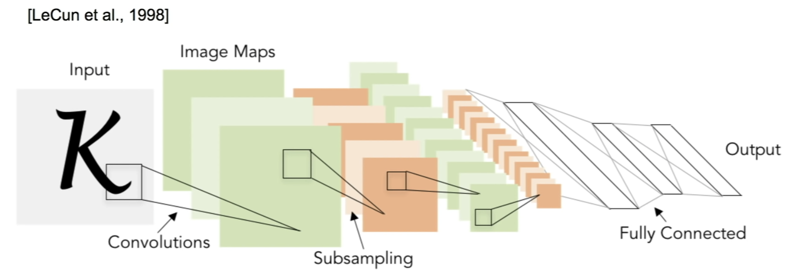

# Lecture 9 | CNN Architectures

### Review

- Deep Learning Frameworks
  - Easily build big computational graphs
  - Easily compute gradients in computational graphs
  - Run it all efficiently on GPU(wrap cuDNN, cuBLAS, etc)

### Overview

- Case Studies
  - AlexNet
  - VGG
  - GoogleNet
  - ResNet

### LeNet-5

- Conv filters were 5x5, applied at stride 1
- Pooling layers were 2x2 applied at stride 2
- very successfully applied to digit recognition

### AlexNet

- the first large scale convolutional neural network