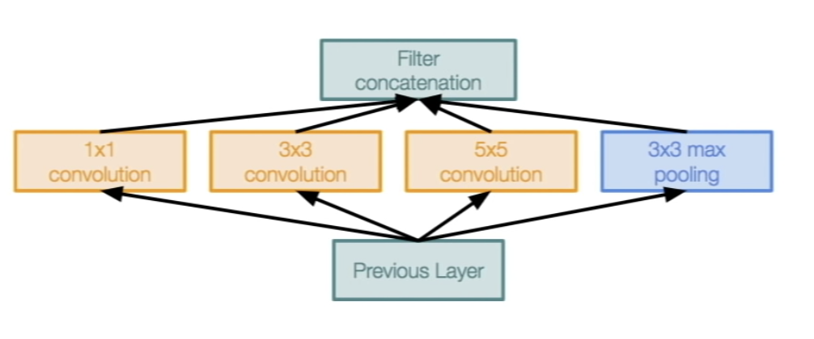
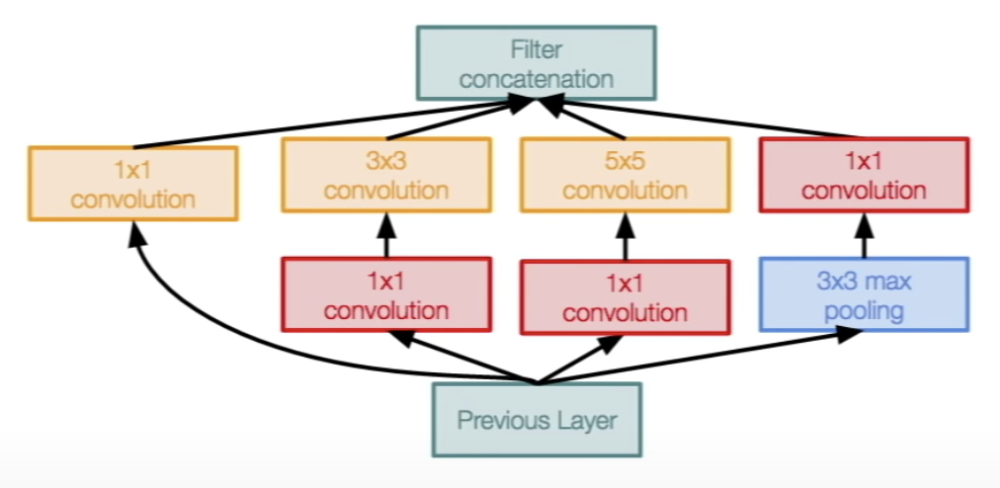
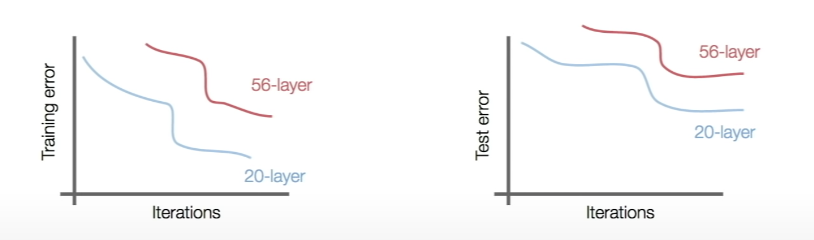
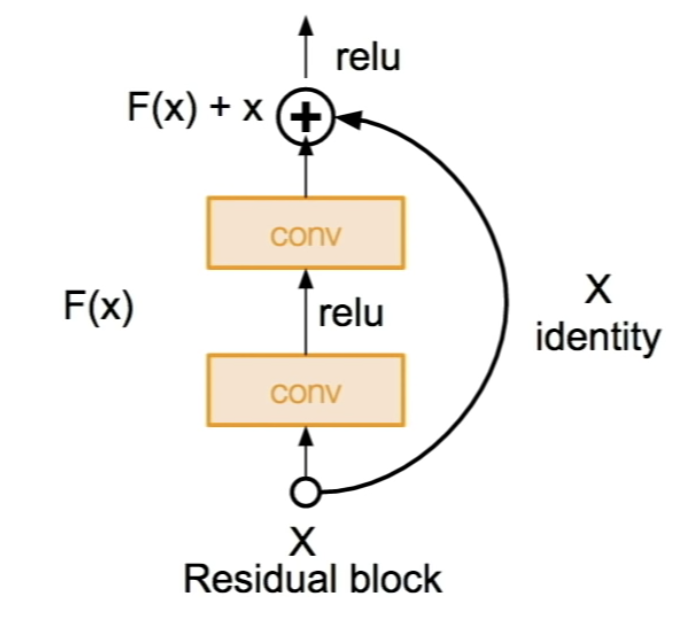
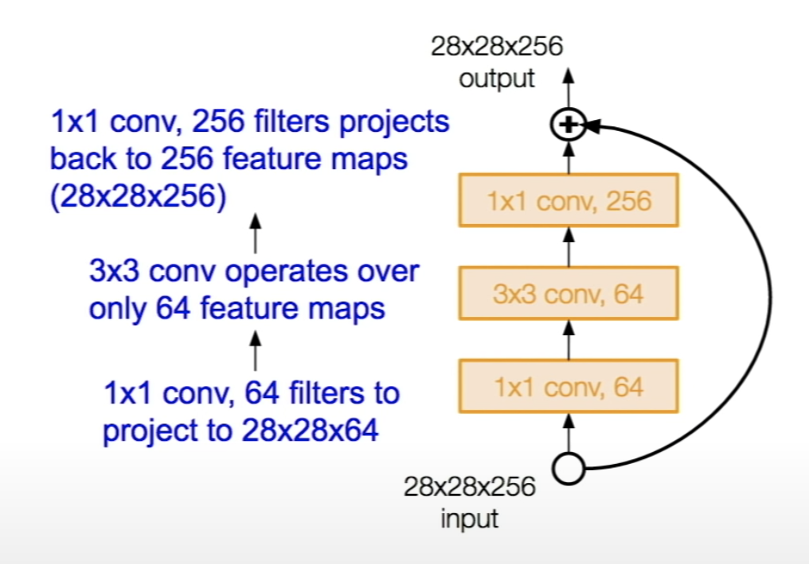
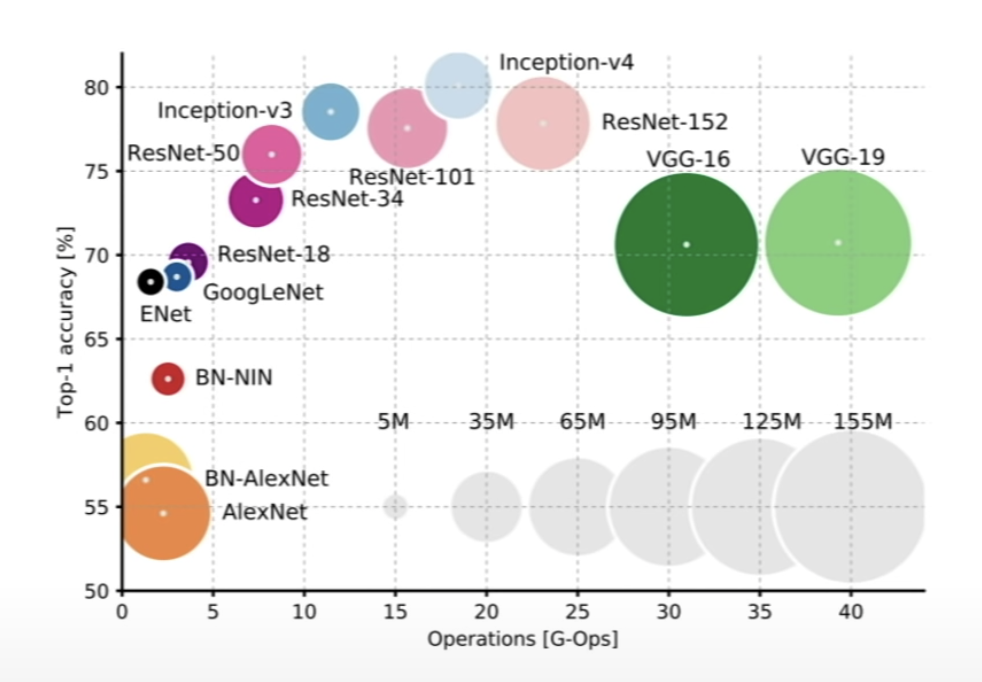
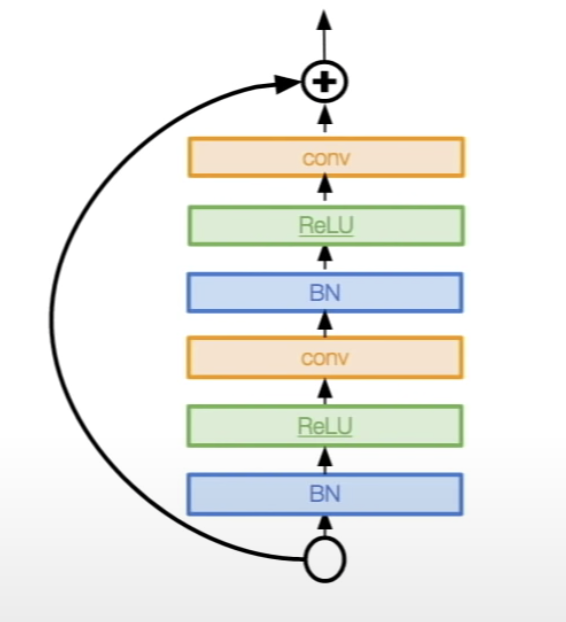
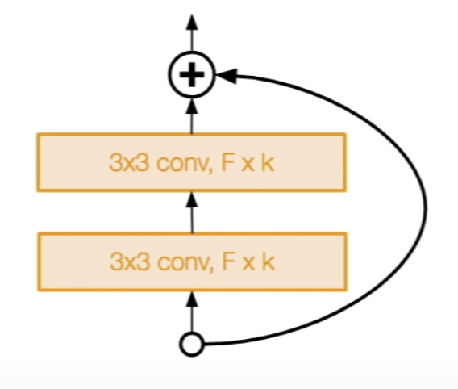

# Lecture 9 | CNN Architectures

### Review

- Deep Learning Frameworks
  - Easily build big computational graphs
  - Easily compute gradients in computational graphs
  - Run it all efficiently on GPU(wrap cuDNN, cuBLAS, etc)

### Overview

- Case Studies
  - AlexNet
  - VGG
  - GoogleNet
  - ResNet

### LeNet-5

- Conv filters were 5x5, applied at stride 1
- Pooling layers were 2x2 applied at stride 2
- very successfully applied to digit recognition

### AlexNet

- 
- the first large scale convolutional neural network
- the first user of ReLU
- used Norm layers (not common anymore)
- do well on the ImageNet classification task
- 5 conv layers, 2 fully connected layers, 1 final fully connected layer
- first layer(Conv1) : 96 11x11 filters applied at stride 4
  - Q1: what is the output volume size?
    - (227 - 11) / 4 + 1 = 55
    - 55x55 96 
  - Q2: what is the total number of parameters in this layer?
    - (11 x 11 x 3) x 96
- second layer(Pool1): 3x3 filters applied at stride 2
  - Q1: what is the output volume size?
    - (55 - 3) / 2 + 1 = 27
    - 27x27 96
  - Q2: what is the numbr of parameters in this layer?
    - 0
    - pooling layer has no parameters
- 

Q: why ae there no parameters in the pooling layer?

A: the parameters are the weights,that's we try to learn. convolutional layers have weights that we learn but pooling all we do is have a rule, we look at the pooling region, and we take the max. so there's no parameters that are learned.

Q: why does it say "full simplified AlexNet architecture" here?

A: it just says that because i didn't put all the details on here. for example this it the full set of layers in the architecture, and the strides and so on, but the normalization layer, these details are not written on here.

Q: intuition why AlexNet was so much better than the ones that came before?

A: this is a very different kind of approach in architecture. this was the first deep learning based approach.

### ZFNet

- Zeller Fergus Net
- 
- similar with AlexNet
- Conv1: chanege from (11x11 stride 4) ti (7x7 stride 2)
- Conv3,4,5: instead of 384, 384, 256 filters use 512, 1024 512

### VGGNet

- the idea of much deeper networks and with much smaller filters.
- increased the number of layers from 8 layers in AlexNet right to now they had models with 16 to 19 layers in VGGNet.
- 
- only 3x3 Conv stride 1, pad 1
- Q1: why use smaller filters?(3x3 Conv)
  - when we take these small filters we have fewer parameters and we try and stack more of them instead of having larger filters, have smaller filters with more depth instead.
  - what happends is that you end up having the same effective receptive field as if you only have one 7x7 convolutoinal layer.
- Q2: what is the effective receptive field of three 3x3 conv (stride 1) layers?
  - what actually is happening thought is you have to see, at the first layer, the receptive field is going to be 3x3.
  - and then at the second layer, each of these neurons in the second layer is going to look at 3x3 other first layer filters, but the corners of these 3x3 have an additional pixel on each side, that is looking at in the original input layer. so the second layer is actually looking at 5x5 receptive field.
  - and then if you do this again, the third layer is looking at 7x7 in the input layer.
  - so the effective receptive field here is going to be 7x7. which is the same as one 7x7 conv layer.
  - but deeper, more non-linearities, and few parameters
- 
  - total memory: 24M * bytes ~= 96MB / image
  - total params: 138M parameters

Q: what do we mean by deeper, is it the number of filters, number of layers?

A: deeper in this case is always referring to layers. there are two usages of the word depth which is confusing, one is the depth rate per channel, width by height by depth, but in general we talk about the depth of a network, this is going to be the total number of layers in the network.

Q: within each layer what do different filters need?

A: each filter is a set of weight looking at 3x3 value input depth, and this produces one feature map of all the responses of the different spatial locations. 

Q: is there intuition behind as you go deeper into the network we have more channel depth?

A: you can have any design that you want so you don't have to do this. in practice you will see this happen a lot of the times.

Q: performance-wise is there any reason to use SVM instead of softmax

A: no. a classifier you can use either one, but in general softmax losses have generally worked well and been standard use for classification.

Q: we don't have to store all of the memory like we can throw away the parts that we don't need and so on?

A: yes. some of this you don't need to keep, but you're also going to be doing a backwards pass. and when you were doing the chain rule you needed a lot of these activations as part of it and so in large part a lot of this does need to be kept.

### GoogleNet

- 22 layers
- deeper networks, with computational efficiency
- no FC layers
- only 5 million parameters
- inception module
  - stack a lot of local typologies one on top of each other.
  - 
  - multiple receptive field sizes for convolution (1x1, 3x3, 5x5)
  - pooling operation (3x3)
  - Q1: what is the problem with this?
    - computational complexity is going to be a problem in here
    - very expensive computation
  - Q2: what is the output size of the 1x1 conv. with 128 filters?
    - module input: 28x28x256
    - 28x28x128
  - Q3: what are the output sizes of all different filter operations?
    - after 3x3 conv, 192: 28x28x192
    - after 5xx5 conv, 96: 28x28x96
    - after 3x3 pool: 28x28x256
    - after filter concatenation: 28x28x(128+192+96+256) = 28x28x672
  - pooling layer also preserves feature depth, which means total depth after concatenation can only grow at ever layer.
  - solution: use bottlenack layers and project these feature maps to lower dimension before our convolutional operations
  - 

Q: how are we getting 28x28 for everything?

A: here we're doing all the zero padding in order to maintain the spatial dimensions, and that way we can do this filter concatenation depth-wise.

Q: what's the 256 deep at the input?

A: this is not the input to the network, this is the input just to this local module that i'm looking at. in this case 256 is the depth of the previous inception module that came just before this.

Q: how did we get 28x28x128 for the fisrt conv?

A: we're going to take this 1x1 convolution slide it across our 28x28x256 input spatially where it's at each location, it's going to dot product throught the entire 256 depth, and so we do this 1x1 conv slide it over spatially and we get a feature map out that's 28x28x1. each filter produces one of these 28x28x1 maps, and we have here a total 128 filters.

Q: have you looked into what information might be lost by doing this 1x1 conv at the beginning?

A: there might be some information loss, but at the same time if you're doint these projections you're taking a linear combination of these input feature maps which has redundancy in them, you're taking combinations of them, and you're also introducing an additional non-linearity after the 1x1 conv, so it also actually helps in that way with adding a little bit more depth.

Q: are the auxiliary outputs actually useful for the final classification to use these as well?

A: i think when they're training them the do average all these for the losses coming out. i think they are helpful. it seems very possible that they would use all of them,but you'll need to check on that.

Q: for the bottleneck layers, is it possible to use some other types of dimensionality reduction?

A: yes. you can use other kinds of dimensionality reduction. the benefits here of this 1x1 conv is you're getting this effect, but it's all conv layer just like any other.

Q: are any weights shared or they all separate?

A: all of these layers have separate weights.

Q: why do we have to inject gradients at earlier layers?

A: our classification output at the very end, where we get a gradient on this, it's passed all the way back throught the chain rule but the problem is when you have very deep networks and you're going all the way back throught these, some of this gradient signal can become minimized and lost closer to the beginning, and so that's why having these additional ones in earlier parts can help provide some additional signal.

Q: are you doing back prop all the times for each output?

A: no. it's just one back prop all the way through, you can think of there being kind of like an addition at the end of these if you were to draw up your computational graph, and so you get your final signal and you can just take all of these gradients and just back plot them all the way through.

### ResNet

- very deep networks using residual connections
- 152 layer model for ImageNet
- Q1: what happens when we continue stacking deeper layers on a "plain" convolutional neural network?
  - not work better
  - 
  - 56-layer model performs worse on both training and test error
  - the deeper model performs worse, but it's not caused by overfitting.
  - Hypothesis: the problem is an optimization problem, deeper models are harder to optimize.
  - Solution: use network layers to fit a residual mapping instead of directly trying to fit a desired underlying mapping.
  - 
  - at the end of this block we take the step connection on loop, where we just take our input, we just use pass it through as an identity, and so if we had no weight layers in between it was just going to be the identity. it would be the same thing as the output, but now we use our additional weight layers to learn some delta, for some residual from our X.
- every residual block hass two 3x3 conv layers.
- no FC layers at the end.

Q: is there the same dimension?

A: yes. these two paths are the same dimension. in general eighter it's the same dimension, or what they actually do is they have these projections and shortcuts and they have different ways of padding to make things work out to be the same dimension.

Q: what exactly do we mean by residual? this output of the transformation is a residual?

A: where F(X) is the output of oour transformation and then X is our input, just passed through by the identity. we'd like to using a plain layer, what we're trying to do is learn something like H(X), but what we saw earlier is that it's hard to learn H(X). it's a good H(X) as we get very deep networks. and so here the idea is let's try and break it down instead of as H(X) is equal to F(X) + X, and let's just try and lear F(X). so you can think of it as kind of modifying this input, in place in a sense.

Q: when we're saying the word residual are we talking about F(X)?

A: yes.

Q: in practice do we just sum F(X) and X together, or do we learn some weighted combination?

A: you just do a direct sum. because when you do a direct sum, this is the idea of let me just learn what is it i have to add or subtract onto X.

Q: have peopel tried other ways of combining the inputs from previous layers?

A: yes.this is basically a very active area of research on.

 

- for deeper networks, use "bottleneck" layer to improve efficiency

- the size of the circle is memory usage

- identity mappings in depp residual networks
- He et el. 2016
- Gives better performance

- wide residual networks
- Zagoruyko et el. 2016
- increasing width instead of depth more computationally efficient

FractalNet : ultra-deep neural networks without residuals

- Larsson et el. 2017
- argues that key is transitioning effectively from shallow to deep and residual representations are not necessary
- Fractal architecture with both shallow and deep paths to output
- trained with dropping out sub-paths
- full network at test time