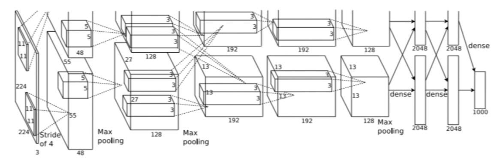
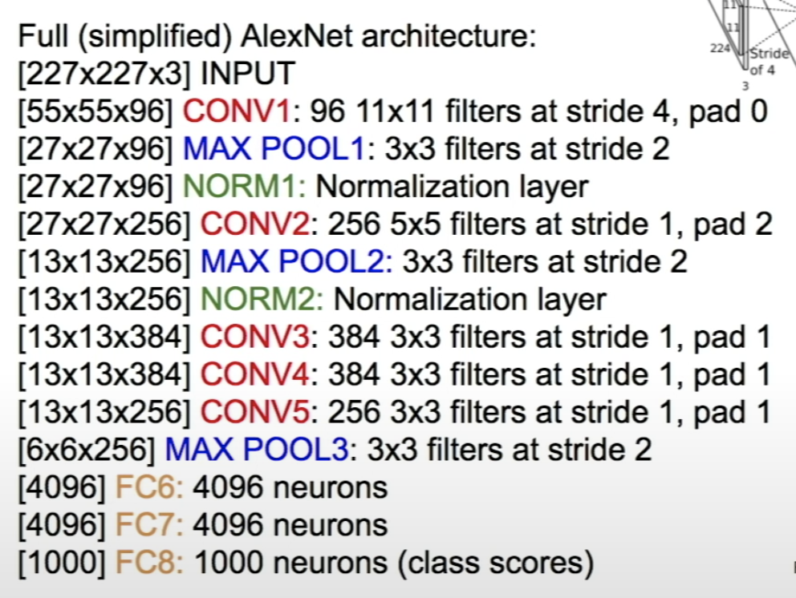
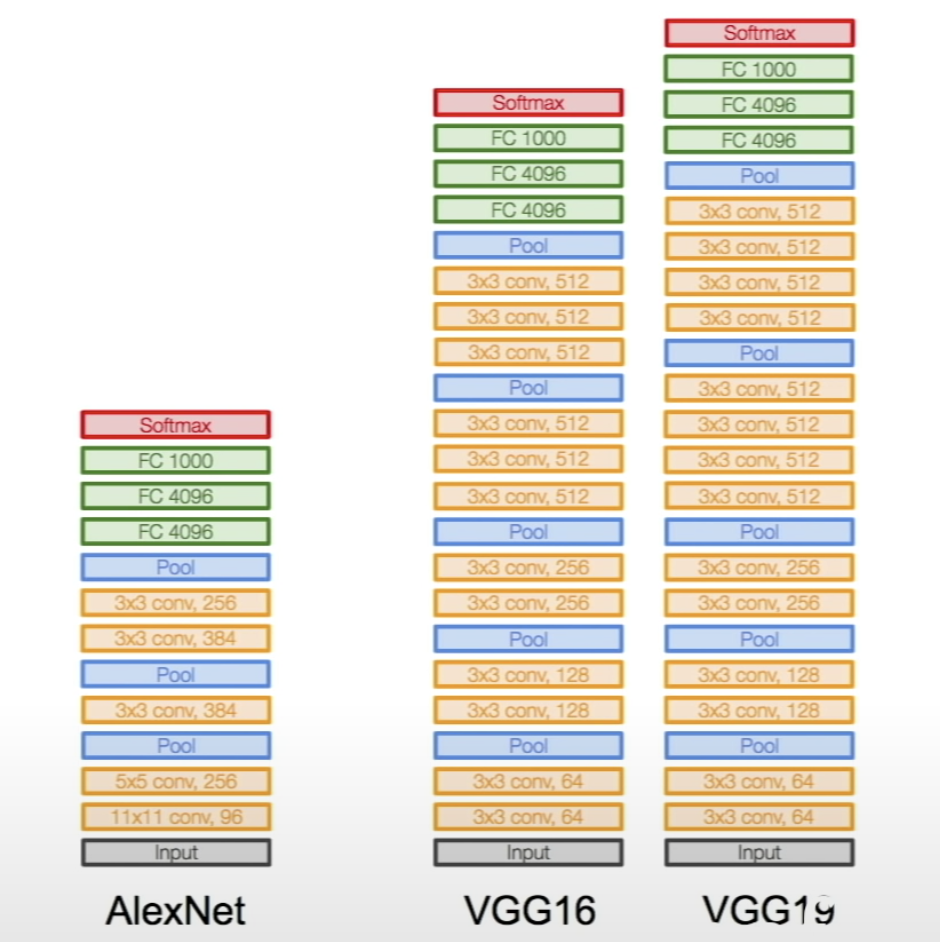
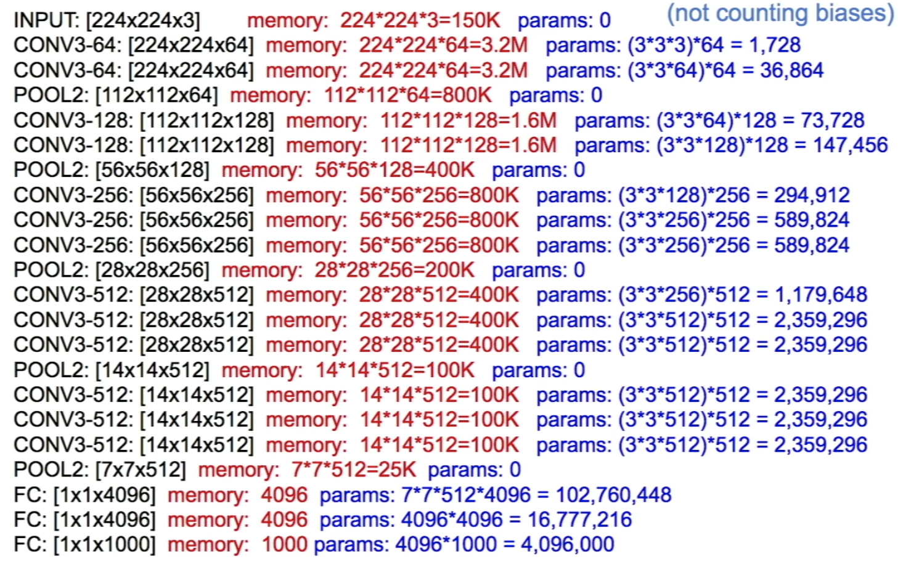

# Lecture 9 | CNN Architectures

### Review

- Deep Learning Frameworks
  - Easily build big computational graphs
  - Easily compute gradients in computational graphs
  - Run it all efficiently on GPU(wrap cuDNN, cuBLAS, etc)

### Overview

- Case Studies
  - AlexNet
  - VGG
  - GoogleNet
  - ResNet

### LeNet-5

- Conv filters were 5x5, applied at stride 1
- Pooling layers were 2x2 applied at stride 2
- very successfully applied to digit recognition

### AlexNet

- 
- the first large scale convolutional neural network
- the first user of ReLU
- used Norm layers (not common anymore)
- do well on the ImageNet classification task
- 5 conv layers, 2 fully connected layers, 1 final fully connected layer
- first layer(Conv1) : 96 11x11 filters applied at stride 4
  - Q1: what is the output volume size?
    - (227 - 11) / 4 + 1 = 55
    - 55x55 96 
  - Q2: what is the total number of parameters in this layer?
    - (11 x 11 x 3) x 96
- second layer(Pool1): 3x3 filters applied at stride 2
  - Q1: what is the output volume size?
    - (55 - 3) / 2 + 1 = 27
    - 27x27 96
  - Q2: what is the numbr of parameters in this layer?
    - 0
    - pooling layer has no parameters
- 

Q: why ae there no parameters in the pooling layer?

A: the parameters are the weights,that's we try to learn. convolutional layers have weights that we learn but pooling all we do is have a rule, we look at the pooling region, and we take the max. so there's no parameters that are learned.

Q: why does it say "full simplified AlexNet architecture" here?

A: it just says that because i didn't put all the details on here. for example this it the full set of layers in the architecture, and the strides and so on, but the normalization layer, these details are not written on here.

Q: intuition why AlexNet was so much better than the ones that came before?

A: this is a very different kind of approach in architecture. this was the first deep learning based approach.

### ZFNet

- Zeller Fergus Net
- 
- similar with AlexNet
- Conv1: chanege from (11x11 stride 4) ti (7x7 stride 2)
- Conv3,4,5: instead of 384, 384, 256 filters use 512, 1024 512

### VGGNet

- the idea of much deeper networks and with much smaller filters.
- increased the number of layers from 8 layers in AlexNet right to now they had models with 16 to 19 layers in VGGNet.
- 
- only 3x3 Conv stride 1, pad 1
- Q1: why use smaller filters?(3x3 Conv)
  - when we take these small filters we have fewer parameters and we try and stack more of them instead of having larger filters, have smaller filters with more depth instead.
  - what happends is that you end up having the same effective receptive field as if you only have one 7x7 convolutoinal layer.
- Q2: what is the effective receptive field of three 3x3 conv (stride 1) layers?
  - what actually is happening thought is you have to see, at the first layer, the receptive field is going to be 3x3.
  - and then at the second layer, each of these neurons in the second layer is going to look at 3x3 other first layer filters, but the corners of these 3x3 have an additional pixel on each side, that is looking at in the original input layer. so the second layer is actually looking at 5x5 receptive field.
  - and then if you do this again, the third layer is looking at 7x7 in the input layer.
  - so the effective receptive field here is going to be 7x7. which is the same as one 7x7 conv layer.
  - but deeper, more non-linearities, and few parameters
- 
  - total memory: 24M * bytes ~= 96MB / image
  - total params: 138M parameters

Q: what do we mean by deeper, is it the number of filters, number of layers?

A: deeper in this case is always referring to layers. there are two usages of the word depth which is confusing, one is the depth rate per channel, width by height by depth, but in general we talk about the depth of a network, this is going to be the total number of layers in the network.

Q: within each layer what do different filters need?

A: each filter is a set of weight looking at 3x3 value input depth, and this produces one feature map of all the responses of the different spatial locations. 

Q: is there intuition behind as you go deeper into the network we have more channel depth?

A: you can have any design that you want so you don't have to do this. in practice you will see this happen a lot of the times.

Q: performance-wise is there any reason to use SVM instead of softmax

A: no. a classifier you can use either one, but in general softmax losses have generally worked well and been standard use for classification.

Q: we don't have to store all of the memory like we can throw away the parts that we don't need and so on?

A: yes. some of this you don't need to keep, but you're also going to be doing a backwards pass. and when you were doing the chain rule you needed a lot of these activations as part of it and so in large part a lot of this does need to be kept.

### GoogleNet

- 22 layers
- deeper networks, with computational efficiency
- no FC layers
- only 5 million parameters
- inception module
  - stack a lot of local typologies one on top of each other.

 